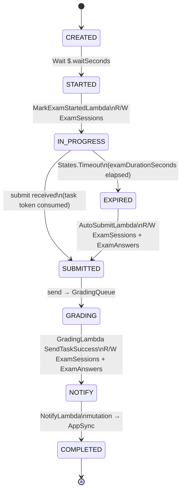

# Architecture & Application Flow

A serverless exam platform where a Step Functions state machine owns the entire exam
lifecycle — from creation through timed answering, grading, and a real-time result
push over an AppSync GraphQL subscription.

Stack: API Gateway (REST) · AWS Step Functions · 8 × Lambda (Node.js 22, ARM64) ·
DynamoDB · SQS + DLQ · AppSync GraphQL.

> An interactive version of this document (with color-coded diagrams) is published at:
> https://claude.ai/code/artifact/1aba914c-53a3-4d13-afcc-ee1c7a0dbe2e

## Entry points

Every request lands on one REST API (`ExamPlatformAPI`, stage `prod`, CORS open,
access-logged to CloudWatch) that fans out to five single-purpose Lambdas.
`StartExamLambda` is the only one that touches Step Functions directly — it's the
ignition switch for the whole state machine below.

| Method | Path | Lambda |
|---|---|---|
| POST | `/exams/start` | `StartExamLambda` |
| GET | `/exams/{examId}/questions` | `GetQuestionsLambda` |
| POST | `/exams/submit` | `SubmitExamLambda` |
| GET | `/exams/{examId}/result/{studentId}` | `GetResultLambda` |
| GET | `/swagger`, `/swagger.json` | `SwaggerUILambda` |

## Exam lifecycle — the state machine

`StartExamLambda` calls `StartExecution` and writes a `CREATED` row to
**ExamSessions**. Everything after that — timing the exam, collecting the
submission, grading, notifying — is driven by the state machine (`ExamSessionStateMachine`,
type `STANDARD`, X-Ray traced, logs to CloudWatch), not by application code polling
anything.



| State | Type | What happens |
|---|---|---|
| `CREATED` | Wait (`$.waitSeconds`) | Admin created the exam session; a 1-second buffer before the flow proceeds. |
| `STARTED` | Lambda — `MarkExamStartedLambda` | Student opened the exam. Records `startedAt` and flips status to `STARTED`. **R/W ExamSessions.** |
| `IN_PROGRESS` | SQS `waitForTaskToken`, timeout = `$.examDurationSeconds` (300s) | Sends `{ taskToken, examId, studentId }` to **ExamQueue**, then blocks. The task token is what `SubmitExamLambda` later plucks off the queue to resume execution — or the timer wins and Step Functions raises `States.Timeout`. **send → ExamQueue.** |
| `EXPIRED` *(catch: States.Timeout)* | Lambda — `AutoSubmitLambda` | Timer fired before submission. Grades whatever answers were already saved and marks the session `EXPIRED` before rejoining the main path. **R/W ExamSessions + ExamAnswers.** |
| `SUBMITTED` | SQS send (fire-and-forget) | Forwards the full state payload to **GradingQueue** — both the on-time path (from `IN_PROGRESS`) and the timeout path (from `EXPIRED`) rejoin here. **send → GradingQueue.** |
| `GRADING` | Lambda — `GradingLambda`, `waitForTaskToken` | Reached two ways: the state machine invokes it directly with a fresh task token, *and* the message just sent to `GradingQueue` triggers it independently via its SQS event source. Only the direct, token-bearing invocation calls `SendTaskSuccess` to unblock this state. **R/W ExamSessions + ExamAnswers, trigger: GradingQueue.** |
| `NOTIFY` | Lambda — `NotifyLambda` | Calls the AppSync `publishExamResult` mutation over HTTPS with an API key, fanning the score out to any open subscription. **mutation → AppSync.** |
| `COMPLETED` | Succeed | Execution ends. Result is already in DynamoDB and already pushed to the client. |

## Data & messaging layer

Two on-demand tables, two work queues, each queue with its own dead-letter queue
after 3 failed receives.

| Resource | Type | Key schema / config |
|---|---|---|
| `ExamSessions` | DynamoDB, PAY_PER_REQUEST | PK `examId` (S), SK `studentId` (S) — tracks status, startedAt, submittedAt/expiredAt, score, completedAt, executionArn |
| `ExamAnswers` | DynamoDB, PAY_PER_REQUEST | PK `examId` (S), SK `questionId` (S) — tracks studentId, answer, isCorrect, savedAt |
| `ExamQueue` | SQS standard | Visibility timeout 7200s, retention 1 day, DLQ `ExamQueueDLQ` (maxReceive 3, 14d retention) |
| `GradingQueue` | SQS standard | Visibility timeout 300s, retention 1 day, DLQ `GradingQueueDLQ` (maxReceive 3, 14d retention) |

## Real-time result delivery

The client never polls for a final score. It opens a GraphQL subscription once, and
the `NOTIFY` state pushes the result through it moments after grading finishes.

```
Client --opens--> onExamCompleted(studentId) subscription      (WebSocket)
NotifyLambda --POST--> publishExamResult mutation               (HTTPS, x-api-key)
AppSync None data source --passthrough--> ExamResult payload
AppSync --fans out--> every open onExamCompleted subscriber     (instant push)
```

```graphql
subscription {
  onExamCompleted(studentId: "student-42") {
    examId
    studentId
    score
    status
    completedAt
  }
}
```

The resolver on the `Mutation.publishExamResult` field uses a **None data source** —
no data store involved, it just echoes the mutation args straight through as the
payload (`lib/appsync/resolvers/publish-exam-result.js`), which AppSync then routes
to subscribers.

## CDK design notes

Four things worth knowing before touching this stack:

1. **`GradingLambda`'s SFN permission is hand-built.** The `GRADING` task invokes
   `GradingLambda`, so granting it `stateMachine.grantTaskResponse()` would create a
   circular CDK dependency (Lambda role → state machine → state machine's role →
   Lambda). Instead its `SendTaskSuccess` policy is attached with a manually composed
   ARN from the fixed state machine name (`lib/statemachine.ts`).
2. **`SwaggerUILambda`'s API base URL is hand-built too.** Its own `/swagger.json`
   route means going through `api.url` (which resolves via the Stage/Deployment)
   would cycle back through the very method being defined. The URL is composed from
   `restApiId` + region + `urlSuffix` instead (`lib/apigateway.ts`).
3. **`StartExamLambda` is built after the state machine, not with the other seven.**
   It's the one Lambda whose dependency arrow points backwards — it needs
   `stateMachine.stateMachineArn` — so `addStartExamLambda()` runs once
   `ExamPlatformStateMachine` already exists.
4. **AppSync is provisioned before the Lambdas.** Every function's environment
   carries `APPSYNC_URL` / `APPSYNC_KEY`, so the GraphQL API is constructed first
   purely to have those values ready to inject.

## Stack composition

`lib/exam-platform-stack.ts` wires five constructs together in dependency order:

| File | Provisions |
|---|---|
| `storage.ts` | `ExamSessions` / `ExamAnswers` tables, `ExamQueue` / `GradingQueue` + DLQs |
| `appsync.ts` | GraphQL API, API key auth, None data source + passthrough resolver |
| `microservices.ts` | 8 `NodejsFunction`s (Node 22 / ARM64) and their table, queue and AppSync grants |
| `statemachine.ts` | `ExamSessionStateMachine` — the 8-state chain above, X-Ray traced, logs to CloudWatch |
| `apigateway.ts` | `ExamPlatformAPI` REST routes, CORS, access logging, Swagger UI routes |
| `exam-platform-stack.ts` | Wires the four constructs above in dependency order, emits `CfnOutput`s |
