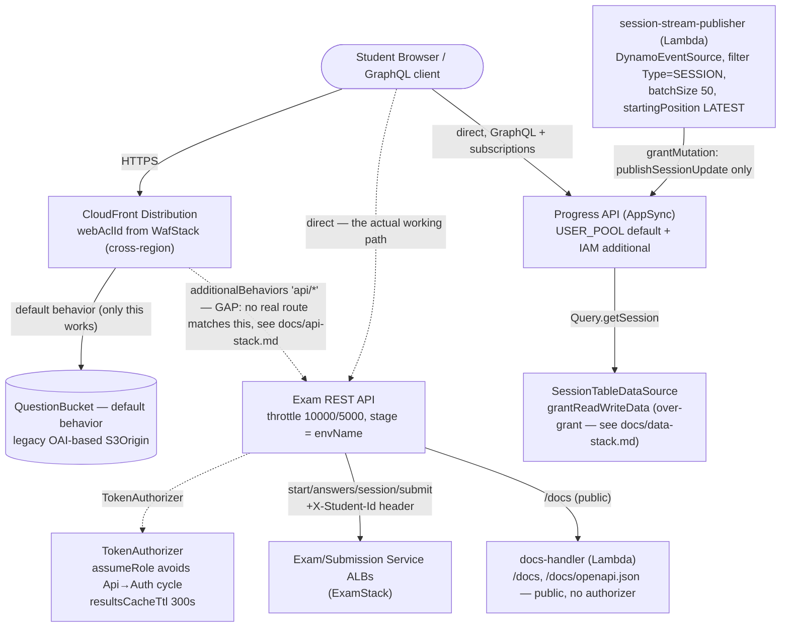

# ApiStack — what's configured and why

`lib/stacks/api-stack.ts` is the platform's front door: the REST API, the GraphQL API, and the
CloudFront distribution in front of them. It deploys last among the "feature" stacks
(`network → data → auth → async → exam → waf/api → monitoring`) because it needs outputs from
every one of them — `auth.userPool`/`authorizerFn`, `data.table`/`questionBucket`,
`exam.examServiceAlbDns`/`submissionServiceAlbDns`, and `waf.webAcl.attrArn` (cross-region — see
`docs/waf-stack.md`). This doc walks through every setting in the file — including a real routing
gap in the CloudFront distribution worth understanding before assuming it fronts the API.

Diagram: [`api-stack.drawio`](./api-stack.drawio) — Mermaid equivalent at the bottom of this file.

---

## REST API: throttling, and the authorizer's cross-stack wiring

```typescript
const restApi = new apigateway.RestApi(this, 'ExamRestApi', {
  restApiName: `${props.envConfig.domainPrefix}-api`,
  deployOptions: {
    stageName: props.envConfig.envName,
    throttlingRateLimit: 10000,
    throttlingBurstLimit: 5000,
  },
});
```

`stageName: props.envConfig.envName` means the deployed URL is
`https://<api-id>.execute-api.<region>.amazonaws.com/dev` (or `/staging`, `/prod`) — the
environment is part of the URL path, not a separate API Gateway custom domain, keeping each
environment's API trivially distinguishable without DNS setup. `throttlingRateLimit: 10000` /
`throttlingBurstLimit: 5000` match CONTEXT.md §7.6's literal spec — applied at the stage's default
method settings, so every route inherits the same account-protecting ceiling unless overridden
per-method later.

```typescript
const authorizerInvocationRole = new iam.Role(this, 'AuthorizerInvocationRole', {
  assumedBy: new iam.ServicePrincipal('apigateway.amazonaws.com'),
});
const authorizer = new apigateway.TokenAuthorizer(this, 'StudentAuthorizer', {
  handler: props.authorizerFn,
  resultsCacheTtl: cdk.Duration.seconds(300),
  assumeRole: authorizerInvocationRole,
});
```

This is the cross-stack cyclic-dependency dodge described from `AuthStack`'s side in
`docs/auth-stack.md` — restated from here: the default `TokenAuthorizer` wiring would grant
`apigateway.amazonaws.com` a **resource-based** permission on `authorizerFn` (which lives in
`AuthStack`) scoped to *this* API's ARN, forcing `AuthStack` to depend back on `ApiStack` on top
of the existing `ApiStack → AuthStack` dependency — a cycle `cdk synth` refuses to build.
`assumeRole` replaces that with an **identity-based** grant on a role created *here*, so the new
permission lives entirely inside `ApiStack`, keeping the dependency one-directional.
`resultsCacheTtl: 300s` means a given token+route combination's `Allow`/`Deny` result is cached
by API Gateway for 5 minutes — `auth-validator` (and its `cognito-idp:GetUser` call) only runs
once per cache window per caller, not on every single request.

```typescript
const backendIntegration = (albDns: string, path: string, httpMethod: string) =>
  new apigateway.HttpIntegration(`http://${albDns}${path}`, {
    httpMethod,
    proxy: true,
    options: {
      requestParameters: {
        'integration.request.path.examId': 'method.request.path.examId',
        'integration.request.header.X-Student-Id': 'context.authorizer.studentId',
      },
    },
  });
```

- **`http://`, not `https://`, to the ALB.** Traffic from API Gateway to the ALB crosses the
  public internet (API Gateway isn't VPC-resident here), unencrypted on that hop. The trust
  boundary this relies on instead is: the ALB only accepts 80/443 from anywhere (see
  `docs/network-stack.md`'s `alb-sg`), and the *backend services* behind it only trust the ALB's
  security group on 8080 — but nothing stops a third party from also reaching the ALB's public
  DNS directly, bypassing the authorizer entirely, since the ALB itself doesn't check for an
  `X-Student-Id` header or validate that a request actually came from this API Gateway. A real
  deployment protecting graded exams should add a shared secret header (API Gateway adds it,
  the Spring Boot services require and verify it) or move to a VPC Link, neither of which exists
  here — this is the same "demo-scope, not full lockdown" trade-off as `docs/waf-stack.md`'s
  single managed rule group.
- **`integration.request.header.X-Student-Id: 'context.authorizer.studentId'`** is what actually
  lets `services/exam-service`/`services/submission-service` know who's calling — API Gateway
  doesn't forward authorizer context values to an HTTP integration's backend unless a method
  explicitly maps them, so without this line both Spring Boot services would see no student
  identity at all and reject every request via their own `MissingStudentIdException` (see
  `docs/exam-stack.md`).

## Swagger docs: deliberately the one public route

```typescript
const docsHandlerFn = new NodejsFunction(this, 'DocsHandlerFunction', { ... });
const docsIntegration = new apigateway.LambdaIntegration(docsHandlerFn);
const docs = restApi.root.addResource('docs');
docs.addMethod('GET', docsIntegration);
docs.addResource('openapi.json').addMethod('GET', docsIntegration);
```

`/docs` and `/docs/openapi.json` are the only two routes on this API with no `methodOptions`
(no `authorizer`) — anyone with the API's URL can read the documentation without a Cognito token,
by design (see `docs/testing.md`). Every other route requires the `TokenAuthorizer` above.

## AppSync: `Query.getSession`, the real-time publisher, and a known over-grant

```typescript
const api = new appsync.GraphqlApi(this, 'ExamProgressApi', {
  definition: appsync.Definition.fromFile(...),
  authorizationConfig: {
    defaultAuthorization: { authorizationType: appsync.AuthorizationType.USER_POOL, userPoolConfig: { userPool: props.userPool } },
    additionalAuthorizationModes: [{ authorizationType: appsync.AuthorizationType.IAM }],
  },
  logConfig: { fieldLogLevel: appsync.FieldLogLevel.ERROR },
});
```

`USER_POOL` as the default mode (validated against the *same* user pool the REST API's authorizer
checks against — see `docs/auth-stack.md`'s note on the two different validation paths into one
identity store) plus `IAM` as an additional mode, specifically so `docs/testing.md`'s workflow
works: the AWS Console's AppSync Queries tab authenticates with your signed-in IAM identity, no
Cognito login needed to test by hand. `logConfig: { fieldLogLevel: ERROR }` logs only resolver
*failures* to CloudWatch, not every successful field resolution — full request/response logging
(`ALL`) would be far noisier and isn't needed unless actively debugging a resolver.

```typescript
const tableDataSource = api.addDynamoDbDataSource('SessionTableDataSource', props.table);
```

This grants `grantReadWriteData` by default (not read-only) even though the only resolver
attached, `Query.getSession`, does a single `GetItem` — see `docs/data-stack.md`'s dedicated note
on this exact gap and the one-line fix (`{ readOnlyAccess: true }`).

```typescript
const streamPublisherFn = new NodejsFunction(this, 'SessionStreamPublisherFunction', { ... });
api.grantMutation(streamPublisherFn, 'publishSessionUpdate');
streamPublisherFn.addEventSource(new lambda_event_sources.DynamoEventSource(props.table, {
  startingPosition: lambda.StartingPosition.LATEST,
  batchSize: 50,
  retryAttempts: 3,
  filters: [lambda.FilterCriteria.filter({ dynamodb: { NewImage: { Type: { S: lambda.FilterRule.isEqual('SESSION') } } } })],
}));
```

- **`startingPosition: LATEST`**, not `TRIM_HORIZON` — this Lambda only cares about session
  changes from the moment it's deployed onward; replaying the table's entire stream history (up
  to 24h of past changes) on first deploy would just fan out a backlog of stale
  `publishSessionUpdate` calls for sessions that may no longer even be active.
- **The `filters` array is what keeps this Lambda from invoking on every table write.** Without
  it, `result-processor` writing a `RESULT` item or `auto-submit` updating a `SESSION` item would
  *both* trigger an invocation just to have the handler immediately discard non-`SESSION` records
  (see `lambda/session-stream-publisher/index.js`'s own `item.Type === 'SESSION'` check) — the
  stream filter does that discarding for free, before a Lambda invocation (and its cost) even
  happens.
- **`api.grantMutation(streamPublisherFn, 'publishSessionUpdate')`** grants exactly
  `appsync:GraphQL` scoped to that one field — this function can't call any *other* mutation or
  query on this API, only the one it needs to fan updates out through subscriptions.

## CloudFront: the routing gap

```typescript
const distribution = new cloudfront.Distribution(this, 'ExamPlatformDistribution', {
  webAclId: props.webAclArn,
  defaultBehavior: { origin: new origins.S3Origin(props.questionBucket), ... },
  additionalBehaviors: {
    'api/*': { origin: new origins.RestApiOrigin(this.restApi), ... },
  },
});
```

**This doesn't currently route any real traffic to the REST API.** Every actual route this
platform defines lives under `/exams/{examId}/...` or `/docs` — none of them start with `/api/`.
CloudFront only forwards a request to the `api/*` behavior's origin if the path matches that
pattern; a request to `https://<cloudfront-domain>/exams/123/start` doesn't match `api/*`, so it
falls through to `defaultBehavior` instead — the S3 origin — and gets back an S3 "no such key"
error (translated into a CloudFront error response), never reaching Exam Service at all. The
`additionalBehaviors` block's actual settings (`cachePolicy: CACHING_DISABLED`,
`allowedMethods: ALLOW_ALL`, `originRequestPolicy: ALL_VIEWER_EXCEPT_HOST_HEADER`) are all exactly
right for fronting an API through CloudFront — matching CONTEXT.md §7.6's literal
"`cachePolicy: CACHING_DISABLED` for API routes" — only the path *pattern* doesn't match this
platform's actual route prefix. This reads like a copy-paste placeholder (`api/*` is a common
generic example in CloudFront docs) that was never updated to this app's real `exams/*`/`docs`
prefixes, not a deeper design flaw — the fix is changing the key from `'api/*'` to cover
`exams/*` (and adding a second behavior or a broader pattern for `/docs*` if Swagger should also
be reachable through the CDN). Until that's fixed, **the REST API is only reachable directly**,
via the `ApiGatewayUrl`/`SwaggerUrl` outputs below — not through `CloudFrontUrl`. (`docs/testing.md`
and `docs/architecture.md` both already point at the direct API Gateway URL for exactly this
reason — they were corrected once this gap was found.)

The S3 origin itself is the **legacy OAI-based** `origins.S3Origin`, not the newer
`S3BucketOrigin` (OAC) — `docs/data-stack.md`'s OAC-vs-cycle note doesn't apply to this stack
specifically, but the code comment right above this line explains the same family of issue: OAC's
bucket policy would be scoped to this distribution's ARN, requiring a statement on a
`DataStack`-owned bucket that references an `ApiStack` resource — `Data → Api`, on top of the
existing `Api → Data` (via `Exam → Data`), a cycle. The OAI-based origin grants a stack-agnostic
canonical user instead, avoiding it, at the cost of using a deprecated construct.

## `CfnOutput`s

| Output | What it actually is |
|---|---|
| `ApiGatewayUrl` | The real, working base URL for every REST route — use this, not `CloudFrontUrl`, until the routing gap above is fixed |
| `SwaggerUrl` | `ApiGatewayUrl` + `/docs` — public, no token |
| `AppSyncEndpoint` | The GraphQL endpoint, called directly by clients — never routed through CloudFront either |
| `AppSyncApiId` | For finding the right API in the AWS Console's Queries tab (see `docs/testing.md`) when more than one AppSync API exists in the account |
| `CloudFrontUrl` | Currently only serves the question bucket's contents — see the gap above |

## Tags

```typescript
cdk.Tags.of(this).add('Project', 'ExamPlatform');
cdk.Tags.of(this).add('Environment', props.envConfig.envName);
```

Same stack-level tagging pattern as every other stack in this app (except `WafStack` — see
`docs/waf-stack.md`'s note on that one inconsistency).

## Cross-stack consumers

| Consumer | What it gets | Why |
|---|---|---|
| `MonitoringStack` | `restApi` (live object) | The API Gateway 5xx alarm and the dashboard's 4xx/5xx widget both read `metricClientError`/`metricServerError` off this object — no IAM grant needed |

---

## Diagram (Mermaid)


