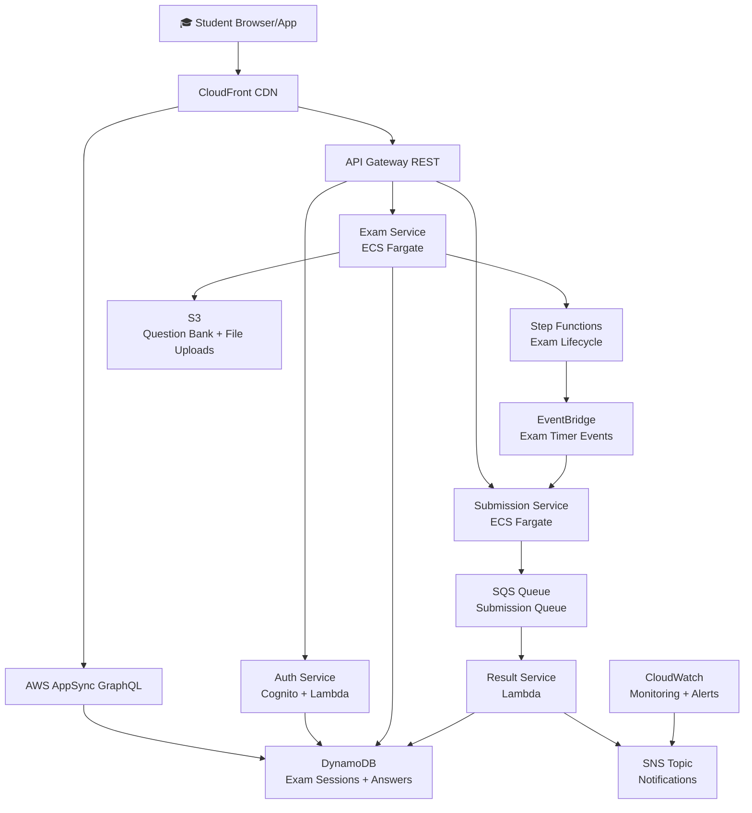
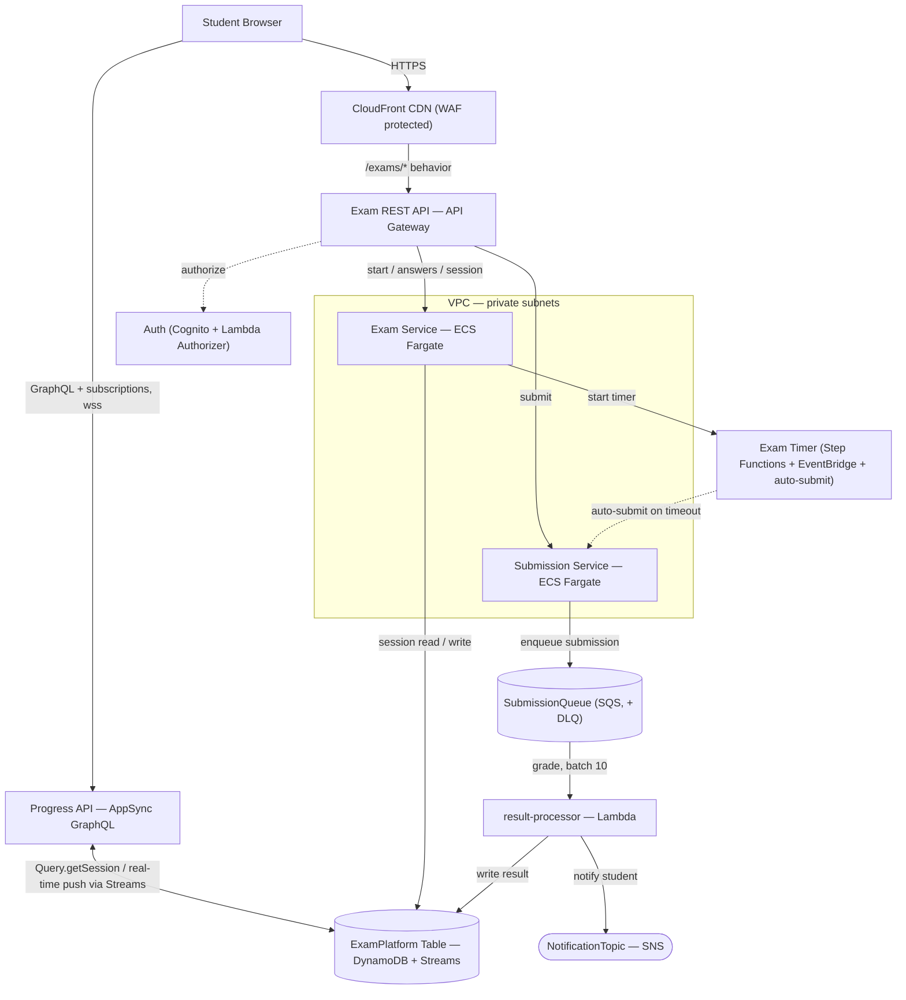
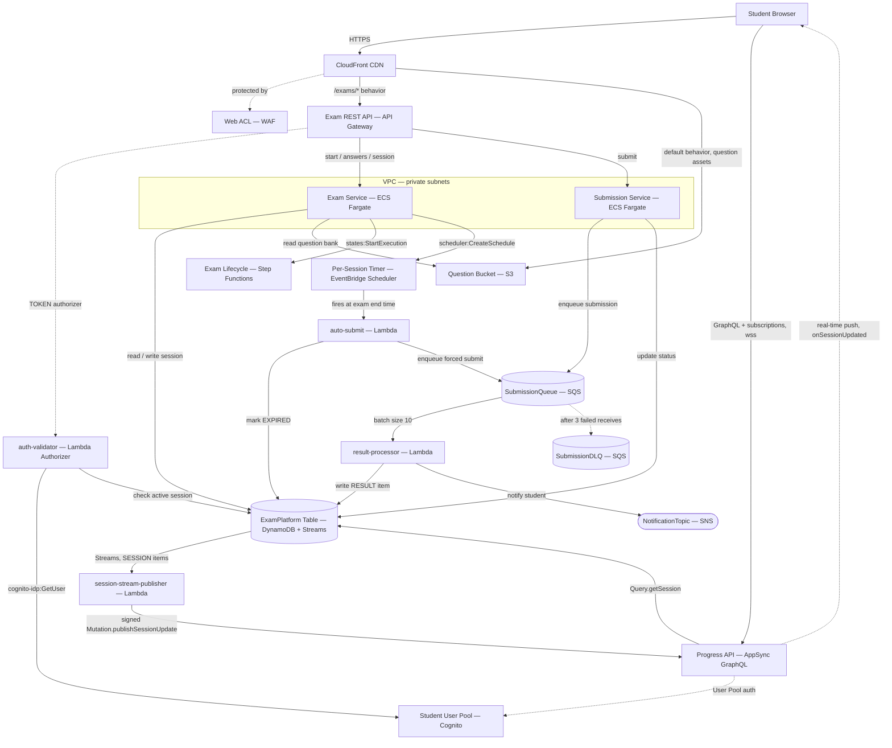
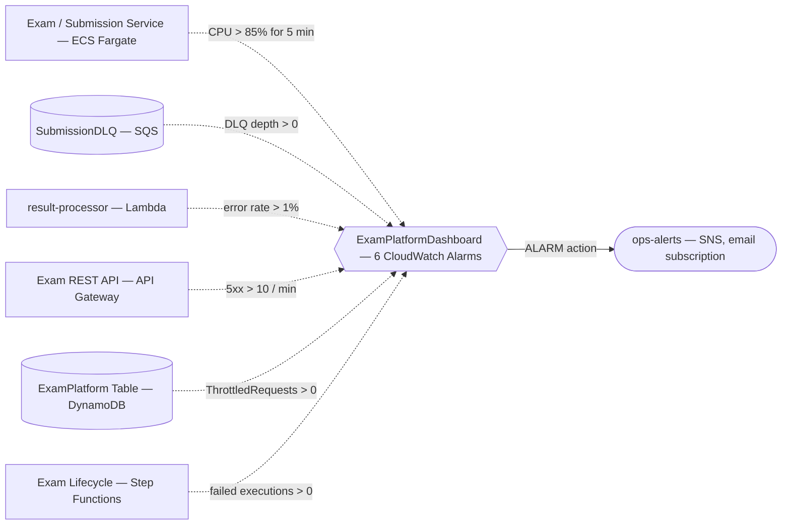

# Online Exam Platform — Architecture

Editable diagrams, roughly ordered from simplest to most detailed:
- [`architecture-birdseye.drawio`](./architecture-birdseye.drawio) — bird's-eye view, plain boxes, no AWS icons (start here)
- [`architecture-flow.drawio`](./architecture-flow.drawio) — simplified flow with AWS service icons
- [`architecture-detailed.drawio`](./architecture-detailed.drawio) — full resource-level detail (every Lambda, the DLQ, S3, EventBridge, etc.)
- [`architecture-alerting.drawio`](./architecture-alerting.drawio) — monitoring → alarms → ops SNS topic

Open any of these at [app.diagrams.net](https://app.diagrams.net) or the VS Code Draw.io extension.
The Mermaid versions below render directly in GitHub/most markdown viewers without any extra tooling.

## Bird's-eye view (mirrors architecture-birdseye.drawio)

The fastest way to explain the system in one glance — every box is a service, no IAM/route-level detail.

## Simplified flow (mirrors architecture-flow.drawio)

Closely-related resources are merged into one box (Cognito + the Lambda authorizer into "Auth";
Step Functions + EventBridge Scheduler + the auto-submit Lambda into "Exam Timer"; the DLQ is a label
on SubmissionQueue, not a separate box) so the request/data flow reads in one pass.

## Full detail (mirrors architecture-detailed.drawio)

## Alerting flow (mirrors architecture-alerting.drawio)

