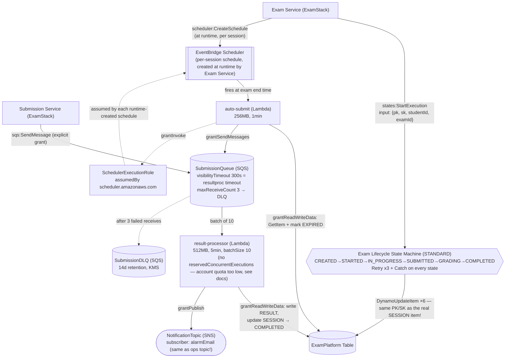

# AsyncStack — what's configured and why

`lib/stacks/async-stack.ts` owns everything that happens *after* a student's request returns —
grading, notifications, the exam-timer fallback, and the exam lifecycle audit trail. It deploys
fourth (`network → data → auth → async → exam → ...`), after `DataStack` (it grants Lambdas
access to `table`) and `AuthStack`, before `ExamStack` (which needs `stateMachineArn`,
`submissionQueueUrl`/`Arn`, `schedulerExecutionRoleArn`, and `autoSubmitFn`'s ARN as props). This
doc walks through every resource in the file and why it's configured the way it is — including
one real correctness gap in the Step Functions state machine worth understanding before relying
on it.

Diagram: [`async-stack.drawio`](./async-stack.drawio) (open at app.diagrams.net or the VS Code
Draw.io extension) — Mermaid equivalent at the bottom of this file.

---

## SubmissionDLQ is built before the queue it serves

```typescript
this.submissionDlq = new sqs.Queue(this, 'SubmissionDLQ', {
  retentionPeriod: cdk.Duration.days(14),
  encryption: sqs.QueueEncryption.KMS_MANAGED,
});
this.submissionQueue = new sqs.Queue(this, 'SubmissionQueue', {
  ...
  deadLetterQueue: { queue: this.submissionDlq, maxReceiveCount: 3 },
});
```

Mechanical, not arbitrary: `SubmissionQueue`'s `deadLetterQueue` prop needs a `Queue` object to
point at, so the DLQ has to exist first. `maxReceiveCount: 3` means a submission gets three
chances to be picked up and processed by `result-processor` before SQS gives up and routes it to
the DLQ instead of retrying forever — three failed attempts at grading the same submission is a
signal something's actually wrong (a bug, a bad payload), not normal backpressure.

## SubmissionQueue: `visibilityTimeout` is tied to the consumer's processing time

```typescript
this.submissionQueue = new sqs.Queue(this, 'SubmissionQueue', {
  visibilityTimeout: cdk.Duration.seconds(300),
  retentionPeriod: cdk.Duration.days(14),
  encryption: sqs.QueueEncryption.KMS_MANAGED,
  ...
});
```

`visibilityTimeout: 300s` exactly matches `resultProcessorFn`'s own `timeout: cdk.Duration.minutes(5)`
below — not a coincidence. If the visibility timeout were shorter than the Lambda's timeout, SQS
could make a message visible to a second consumer *while the first one is still processing it*,
because SQS's only signal that a consumer is "done" is the message being explicitly deleted
(which Lambda's SQS integration does automatically on success) — a slow-but-still-running
invocation would otherwise get double-processed. `retentionPeriod: 14 days` means a message that
somehow never gets consumed (the Lambda is broken, redeployed with a bug, etc.) is still
recoverable for two weeks rather than silently lost — matching the DLQ's own retention so neither
queue is the weaker link.

## NotificationTopic — and who's actually subscribed to it

```typescript
this.notificationTopic = new sns.Topic(this, 'NotificationTopic', {
  displayName: 'Exam Platform Notifications',
});
this.notificationTopic.addSubscription(
  new sns_subscriptions.EmailSubscription(props.envConfig.alarmEmail),
);
```

Worth being precise about what this topic currently *is*, versus the architecture narrative
(CONTEXT.md §3.1: "Result Lambda → SNS (notify student)"). The only subscriber configured here
is `props.envConfig.alarmEmail` — the *same* address `monitoring-stack.ts` subscribes to its own,
separate `OpsAlertTopic` for CloudWatch alarms. There's no per-student delivery mechanism (no SES
call keyed by the student's own email, no per-student subscription) — every result notification
`result-processor` publishes lands in the same single ops inbox as "the DLQ depth alarm fired."
That's a reasonable placeholder for an infra-focused repo with no student-facing notification
service built, but it means this topic is currently an audit/ops channel in practice, not the
"notify student" feature the architecture narrative implies — something to build out (a real SES
send keyed by the student's own address, or a separate per-student topic/subscription mechanism)
before this could notify an actual student of their result.

## result-processor: sizing, concurrency, and the event source

```typescript
this.resultProcessorFn = new NodejsFunction(this, 'ResultProcessorFunction', {
  timeout: cdk.Duration.minutes(5),
  memorySize: 512,
  // no reservedConcurrentExecutions — see note below
  logGroup: new logs.LogGroup(this, 'ResultProcessorLogGroup', {
    logGroupName: '/exam-platform/result-processor',
    retention: logs.RetentionDays.TWO_WEEKS,
    ...
  }),
  ...
});
this.resultProcessorFn.addEventSource(new lambda_event_sources.SqsEventSource(this.submissionQueue, { batchSize: 10 }));
props.table.grantReadWriteData(this.resultProcessorFn);
this.notificationTopic.grantPublish(this.resultProcessorFn);
```

- **`reservedConcurrentExecutions` is currently *not* set, despite `CLAUDE.md`'s explicit rule**
  ("Reserved concurrency required on Result Lambda to prevent runaway costs") — a real account
  constraint, not an oversight. AWS always keeps a minimum of 10 concurrent executions
  "unreserved" per account/region for functions with no reservation of their own; setting a
  reservation of `N` therefore needs the account's *total* concurrency quota to be at least
  `N + 10`. New/free-tier AWS accounts can start with a quota as low as **10** (Service Quotas →
  Lambda → "Concurrent executions", code `L-B99A9384`; AWS's documented default is 1000, but
  that's not what every account actually gets out of the box) — at quota 10, there is zero
  headroom above the floor, so *any* positive `reservedConcurrentExecutions` value fails to
  deploy (`...decreases account's UnreservedConcurrentExecution below its minimum value of
  [10]`). The original intent — capping a queue-flooding bug (a retry loop, a misbehaving client
  hammering `/submit`) at a fixed number of concurrent grading runs instead of scaling unbounded
  — still stands; re-add `reservedConcurrentExecutions: 100` (or whatever fits) once the
  account's quota is raised, which is a free, usually-fast-to-approve Service Quotas request, not
  a billing change.
- **`batchSize: 10`** trades a little latency (waiting to either fill a batch of 10 or hit SQS's
  short polling window) for far fewer Lambda invocations than batch size 1 — grading isn't
  latency-critical the way an interactive API call is, so this is a straightforward cost/throughput
  win with no real downside here.
- **`grantReadWriteData` on the table, `grantPublish` on the topic** — both used:
  `lambda/result-processor/index.js` does `PutItem` (the `RESULT` item), `UpdateItem` (flips
  `SESSION.status` to `COMPLETED`), and a `Query` (reading the student's `ANSWER` items to grade)
  — genuinely needs read+write, unlike a couple of narrower-than-default grants noted in
  `docs/data-stack.md`.
- **Explicit log group, 14-day retention** — matches CONTEXT.md §7.7's literal spec for this
  function, same reasoning as `auth-validator`'s log group in `docs/auth-stack.md`.

## auto-submit: the EventBridge Scheduler's fallback path

```typescript
this.autoSubmitFn = new NodejsFunction(this, 'AutoSubmitFunction', {
  timeout: cdk.Duration.minutes(1),
  memorySize: 256,
  ...
});
props.table.grantReadWriteData(this.autoSubmitFn);
this.submissionQueue.grantSendMessages(this.autoSubmitFn);
```

`lambda/auto-submit/index.js` only ever calls `GetItem` (read the session) and `UpdateItem` (mark
it `EXPIRED`) — `grantReadWriteData` is a slightly looser grant than that function's actual usage
needs (it also implicitly allows `PutItem`/`DeleteItem`/`Scan`/`Query`/batch operations this
function never calls), the same category of over-grant as `addDynamoDbDataSource`'s default
noted in `docs/data-stack.md`. Worth tightening to an explicit `dynamodb:GetItem` +
`dynamodb:UpdateItem` policy statement if this function is ever extended, following the pattern
already used for Submission Service's task role in `exam-stack.ts`. `60s` timeout (vs.
`result-processor`'s `5min`) reflects that this function does much less work per invocation — one
conditional read, one conditional write, one SQS send, not a full grading pass.

## SchedulerExecutionRole: a permission boundary created once, assumed many times at runtime

```typescript
this.schedulerExecutionRole = new iam.Role(this, 'SchedulerExecutionRole', {
  roleName: `${props.envConfig.domainPrefix}-scheduler-exec-role`,
  assumedBy: new iam.ServicePrincipal('scheduler.amazonaws.com'),
});
this.autoSubmitFn.grantInvoke(this.schedulerExecutionRole);
```

EventBridge Scheduler needs **one schedule per exam session**, fired at that session's specific
end time — but sessions start dynamically, whenever a student calls `POST /exams/{id}/start`,
not at CDK synth/deploy time. CDK can't pre-create something that doesn't exist yet, so this
stack instead creates the one thing that *can* be known up front: the IAM role any such schedule
will need to assume in order to invoke `auto-submit`. `services/exam-service`'s
`ExamSessionService.scheduleAutoSubmit` is what actually calls `scheduler:CreateSchedule` at
runtime (in `ExamStack`, granted `iam:PassRole` on this exact role's ARN — see
`docs/exam-stack.md`), handing AWS this pre-created
role's ARN as the new schedule's execution role. `grantInvoke` here is the safe, same-stack
version of the same `lambda:InvokeFunction` problem `docs/auth-stack.md` describes for the REST
API authorizer — but because both `autoSubmitFn` and `schedulerExecutionRole` live in this same
stack, there's no `Auth → Api`-style cyclic-dependency risk to design around; this is just a
plain identity-based grant on the role.

## Exam Lifecycle State Machine: STANDARD, Retry/Catch — and a real correctness gap

```typescript
return new sfn.StateMachine(this, 'ExamLifecycleStateMachine', {
  stateMachineType: sfn.StateMachineType.STANDARD,
  definitionBody: sfn.DefinitionBody.fromChainable(definition),
  logs: { destination: logGroup, level: sfn.LogLevel.ALL },
});
```

- **`StateMachineType.STANDARD`, not `EXPRESS`.** Matches CONTEXT.md §13's explicit rule ("not
  EXPRESS — we need execution history"). STANDARD retains a queryable execution history per run
  (useful for "what happened to this specific student's exam" support/audit questions); EXPRESS
  is cheaper but only logs to CloudWatch, with no per-execution detail to inspect later.
- **Every state (`Created`/`Started`/`InProgress`/`Submitted`/`Grading`/`Completed`) is a direct
  `tasks.DynamoUpdateItem` service integration, not a Lambda.** A direct integration calls
  DynamoDB straight from the Step Functions service — no Lambda cold start, no extra compute
  cost, for a transition that's just "write one attribute." Each one carries the same `Retry`
  (3 attempts, exponential backoff starting at 2s) and `Catch` (→ a `Fail` state) — matching
  CONTEXT.md §13's "every state must have Retry and Catch."
- **`resultPath: sfn.JsonPath.DISCARD` on every state.** A `DynamoUpdateItem` task's *output* is
  the raw DynamoDB API response — not useful to the next state, which only needs the *original*
  input (`$.pk`/`$.sk`) to keep targeting the same item. `DISCARD` keeps that original input
  flowing through unchanged from state to state instead of replacing it with each task's
  response.

**The gap:** this chain has no `Wait`, no task-token pause, nothing gating one state behind a
real-world event — `services/exam-service`'s `ExamSessionService.startLifecycleExecution` calls
`StartExecution` with `{ pk, sk, studentId, examId }` (the *exact* `PK`/`SK` of the just-created
`SESSION` item) immediately after writing that item with `status: STARTED`, and the six states
then run end-to-end in a single execution with nothing to slow them down — realistically
completing in well under a second. That means moments after a student starts their exam, this
state machine independently overwrites the *same* `SESSION.status` attribute straight through to
`COMPLETED` — racing the real status transitions that `services/submission-service` (`SUBMITTED`),
`auto-submit` (`EXPIRED`), and `result-processor` (`COMPLETED`) make hours later, based on what
actually happens. Worse: `lambda/auth-validator/index.js`'s `hasActiveSession` only authorizes
requests when `status` is `STARTED` or `IN_PROGRESS` — so as currently wired, every subsequent
`answers`/`session`/`submit` call for that student+exam would be **denied** almost immediately
after `start`, because this state machine already stamped the session `COMPLETED` first. The code
comment directly above `buildStateMachine` already flags the simplification ("real exams run for
hours... kept as a direct chain here to keep the state machine's shape readable and
synth-testable") — this is the concrete consequence of that simplification if the state machine
is ever actually exercised end-to-end rather than just synthesized/tested in isolation. The fix
described in that comment is the right one: the `InProgress` state needs to pause on a task token
(`sfn.IntegrationPattern.WAIT_FOR_TASK_TOKEN`) that Submission Service or `auto-submit` resolves
by calling `SendTaskSuccess`/`SendTaskFailure` when the student actually submits or the timer
fires — not fall straight through.

## `CfnOutput`s and cross-stack consumers

Same documentation/ops-tooling pattern as every other stack — the real wiring is `bin/app.ts`
passing `asyncStack.stateMachine` / `.submissionQueue` / `.schedulerExecutionRole` / `.autoSubmitFn`
/ `.submissionDlq` / `.resultProcessorFn` directly as typed props:

| Consumer | What it gets | Why |
|---|---|---|
| `ExamStack` | `stateMachineArn`, `schedulerExecutionRoleArn`, `autoSubmitFunctionArn` (strings) | Exam Service's task role needs `states:StartExecution` + `scheduler:CreateSchedule` + `iam:PassRole` on these ARNs — see `docs/exam-stack.md` |
| `ExamStack` | `submissionQueueUrl`/`Arn` (strings) | Submission Service sends to this queue directly (`sqs:SendMessage`, an explicit narrow grant, not `grantSendMessages` — see `docs/data-stack.md`'s least-privilege theme) |
| `MonitoringStack` | `submissionQueue`, `submissionDlq`, `resultProcessorFn`, `stateMachine` (live objects) | DLQ depth alarm, ResultProcessor error-rate alarm, Step Functions failed-execution alarm, and dashboard widgets all read CloudWatch metrics off these — no IAM grant needed, same as `docs/data-stack.md`'s MonitoringStack row |

## Tags

```typescript
cdk.Tags.of(this).add('Project', 'ExamPlatform');
cdk.Tags.of(this).add('Environment', props.envConfig.envName);
```

Same stack-level tagging pattern as every other stack in this app.

---

## Diagram (Mermaid)


