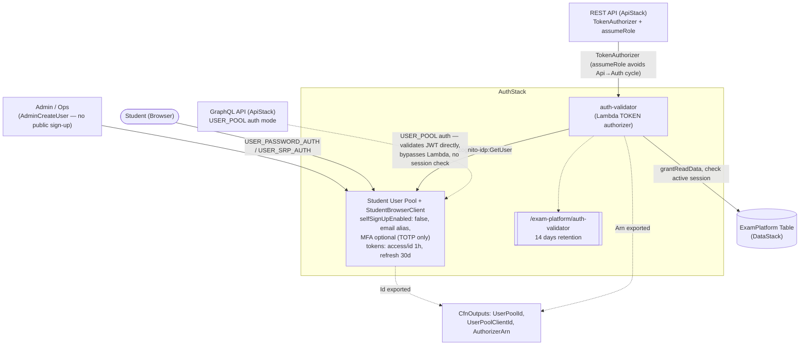

# AuthStack — what's configured and why

`lib/stacks/auth-stack.ts` owns the platform's only identity store: a Cognito User Pool for
students, and the Lambda TOKEN authorizer (`auth-validator`) that fronts every REST route. It
deploys third (`network → data → auth → ...`) specifically *because* the authorizer needs
`DataStack`'s table to check for an active session — see `CLAUDE.md`'s "Stack Dependencies"
note. This doc walks through every setting in the file and why it's that way, plus the one
genuine token-lifetime trade-off worth knowing about before you build a real exam client against
this.

Diagram: [`auth-stack.drawio`](./auth-stack.drawio) (open at app.diagrams.net or the VS Code
Draw.io extension) — Mermaid equivalent at the bottom of this file.

---

## Cognito User Pool: locked down to admin-provisioned students

```typescript
this.userPool = new cognito.UserPool(this, 'StudentUserPool', {
  selfSignUpEnabled: false,
  signInAliases: { email: true },
  standardAttributes: { email: { required: true, mutable: false } },
  passwordPolicy: { minLength: 8, requireUppercase: true, requireDigits: true, requireLowercase: false, requireSymbols: false },
  mfa: cognito.Mfa.OPTIONAL,
  mfaSecondFactor: { sms: false, otp: true },
  accountRecovery: cognito.AccountRecovery.EMAIL_ONLY,
  ...
});
```

- **`selfSignUpEnabled: false`.** Exam takers are enrolled students, not anyone who shows up and
  registers — accounts come from wherever the institution's roster lives (out of scope for this
  infra repo), provisioned via `AdminCreateUser`. Self-signup would mean anyone could create an
  account and attempt to start an exam session; this setting makes that structurally impossible
  rather than relying on application code to reject it.
- **`signInAliases: { email: true }`.** This is the one setting in this stack worth double
  checking the synthesized template for, not just the CDK call: it actually produces
  `UsernameAttributes: ['email']` in CloudFormation, *not* `AliasAttributes`. Cognito treats
  `signInAliases: { email: true }` as "email **is** the username" (no separate alias), versus
  `AliasAttributes`, which is for when a pool *also* supports signing in with an alias on top of
  a separate native username. There's no separate "username" anywhere in this platform's design
  (CONTEXT.md never mentions one), so this is the correct one of the two — but it's an easy
  thing to get backwards when writing a test or reading the template, which is exactly the
  mistake `test/auth-stack.test.ts` caught during development.
- **`passwordPolicy`: upper+digit required, lower+symbol not required.** `minLength: 8` plus
  `requireUppercase`/`requireDigits` is Cognito's own minimum-viable complexity baseline,
  matching CONTEXT.md §7.2's literal spec ("min 8 chars, requires uppercase + number") rather
  than a stricter policy invented on top of it. Lowercase and symbols aren't required because
  the spec doesn't ask for them — there's no security requirement being skipped here, just no
  requirement to exceed what was actually specified.
- **`mfa: OPTIONAL` with `otp: true`, `sms: false`.** MFA is offered, not mandatory — exam
  integrity benefits from it (harder to share/borrow a login), but mandating it for every student
  would add enrollment friction this platform doesn't try to solve (device provisioning, support
  flow for lost devices). TOTP-only (no SMS) sidesteps SMS's well-known weaknesses (SIM-swap
  attacks, carrier delivery delays, and the per-message cost) — TOTP only needs an authenticator
  app, no telephony account needed for AWS to provision or pay for.
- **`accountRecovery: EMAIL_ONLY`.** The only contact channel this platform collects at all is
  email (`standardAttributes.email`, no phone number anywhere in the schema) — `EMAIL_ONLY` is
  the only recovery option that's actually usable given that, not an arbitrary pick among several
  viable choices.
- **`removalPolicy`: `RETAIN` in prod, `DESTROY` elsewhere.** Same reasoning as `DataStack`'s
  table and bucket (see `docs/data-stack.md`): `cdk destroy` must never be able to wipe out every
  prod student account by accident, while dev/staging should tear down cleanly on every iteration.

## User Pool Client: a public browser client, not a confidential one

```typescript
this.userPoolClient = this.userPool.addClient('StudentBrowserClient', {
  generateSecret: false,
  authFlows: { userPassword: true, userSrp: true },
  accessTokenValidity: cdk.Duration.hours(1),
  idTokenValidity: cdk.Duration.hours(1),
  refreshTokenValidity: cdk.Duration.days(30),
});
```

- **`generateSecret: false`.** This client is meant to run in a student's browser. A client
  secret embedded in browser-deliverable JavaScript isn't a secret — anyone can read it out of
  the page source — so requesting one here would be security theater, not security. Cognito's
  "public client" pattern (no secret, rely on SRP) exists for exactly this case.
- **`userSrp: true`** (Secure Remote Password) is what makes the no-secret client safe: the
  client never transmits the password itself, only proves it knows it. **`userPassword: true`**
  is also enabled alongside it — simpler to call from a script/test harness (`docs/testing.md`'s
  `aws cognito-idp initiate-auth --auth-flow USER_PASSWORD_AUTH` example uses exactly this flow)
  without needing an SRP-capable client library. Admin/custom auth flows aren't enabled because
  nothing in this platform calls them — students authenticate themselves, nothing administers
  sessions on their behalf.
- **Token lifetimes — and the one real gap worth knowing about.** Access/ID tokens last 1 hour;
  refresh tokens last 30 days. The refresh token lifetime is an easy call (a month between
  logins is reasonable for a returning student). The 1-hour access token is the one to pay
  attention to: `services/exam-service`'s default exam duration
  (`examplatform.exam-duration-seconds`, defaulting to `5400` = **90 minutes** — see
  `ExamPlatformProperties`) is *longer* than the access token's 1-hour validity. A student deep
  into a 90-minute exam will have their access token expire **before they submit** — every
  subsequent `auto-save` or `session` call's `auth-validator` Cognito `GetUser` call will fail on
  the now-expired token, and the authorizer returns `Deny`. Nothing in this repo currently
  refreshes the access token proactively using the refresh token (there's no frontend client
  built here to do it — see `docs/deploying-services.md`/`docs/testing.md`, both backend/API-
  level). Any real exam-taking client built against this API **must** silently call
  Cognito's `REFRESH_TOKEN_AUTH` flow before the access token expires (or on the first 401), or
  raise `accessTokenValidity` to comfortably exceed `examDurationSeconds`. This is exactly the
  kind of cross-cutting gap that's easy to miss when each piece (token lifetime here, exam
  duration in `exam-service`) is configured correctly in isolation — flagged here so it isn't
  rediscovered the hard way mid-exam.

## `auth-validator`: why a custom Lambda authorizer, not the built-in Cognito authorizer

```typescript
this.authorizerFn = new NodejsFunction(this, 'AuthorizerFunction', {
  runtime: lambda.Runtime.NODEJS_20_X,
  entry: join(__dirname, '../../lambda/auth-validator/index.js'),
  ...
  environment: { TABLE_NAME: props.table.tableName, USER_POOL_ID: this.userPool.userPoolId },
});
```

API Gateway has a built-in `CognitoUserPoolsAuthorizer` that validates a JWT against a user pool
with zero custom code. This platform doesn't use it, because token validity alone isn't the
actual authorization question: per CONTEXT.md §7.2, the authorizer also has to confirm "an active
exam session in DynamoDB" for the specific `examId` in the request path — business logic the
built-in authorizer has no hook for. A Lambda authorizer is the only way to add that check, so
that's what this is — see `lambda/auth-validator/index.js`'s `hasActiveSession`.

- **`NodejsFunction`, not a plain `lambda.Function`.** Matches this repo's JS-Lambda convention
  across every function (see `CLAUDE.md`'s Lambda Functions section) — ESM `index.js`, esbuild
  bundling, no build step.
- **`cognito-idp:GetUser` instead of verifying the JWT locally.** The handler calls Cognito's own
  `GetUser` API with the bearer token rather than fetching the pool's JWKS and verifying the
  signature/expiry itself. This trades a network call (Cognito, not free, and adds latency to
  every authorized request — mitigated by the authorizer's own 300s result cache, set on
  `apigateway.TokenAuthorizer`'s `resultsCacheTtl` in `api-stack.ts`, not here) for *not* needing
  a JWT verification library, JWKS caching, or clock-skew handling in this function at all —
  and it gets token **revocation** checking for free (a verified-signature-only check can't tell
  a since-revoked token from a still-valid one; `GetUser` can, because it asks Cognito directly).
- **The explicit `cognito-idp:GetUser` grant is scoped to `this.userPool.userPoolArn`, not `*`.**
  This function can only validate tokens issued by *this* pool — it has no IAM path to call
  `GetUser` against any other user pool in the account, let alone any of Cognito's admin-level
  actions (`AdminCreateUser`, `AdminSetUserPassword`, etc., which this function never calls).
- **`props.table.grantReadData`, not `grantReadWriteData`.** `hasActiveSession` only ever calls
  `GetItem` — this function never writes to the table, so it doesn't get write permissions it
  has no use for. Contrast this with `ApiStack`'s AppSync data source, which *does* get
  `grantReadWriteData` by default even though it also only reads — see `docs/data-stack.md`'s
  note on that gap. This function is the one place in the platform where the grant already
  matches actual usage exactly.
- **Explicit named log group, `/exam-platform/auth-validator`, 14-day retention.** Matches
  CONTEXT.md §7.7's literal log group spec; without passing `logGroup` explicitly, CDK would
  default to an auto-named `/aws/lambda/<function-name>` group with no retention limit (logs
  kept forever, an unbounded and easy-to-forget cost).
- **Why this Lambda lives in `AuthStack`, not `ApiStack` (which is the only thing that invokes
  it).** `AuthStack` owns *identity* — the user pool, and anything whose job is to validate
  against it — regardless of which API happens to call it. Today only the REST API does (see
  below); if a second REST API or another protocol needed the same active-session check later,
  it would reuse this same function rather than `ApiStack` needing to own an identity-validation
  concern that isn't really about its own APIs.

## Cross-stack wiring: two different paths into the same identity store

`ApiStack` is the only consumer of everything `AuthStack` exports, and it uses the user pool two
different ways for its two different APIs:

- **REST API → `apigateway.TokenAuthorizer(handler: props.authorizerFn, assumeRole: ...)`.**
  `AuthStack` only builds the Lambda; it has zero knowledge of API Gateway. All the
  authorizer-specific wiring (the `TokenAuthorizer` construct, and the `AuthorizerInvocationRole`
  that exists purely so the invoke-permission grant doesn't create an `Auth → Api` cyclic
  dependency on top of the existing `Api → Auth` one) lives entirely in `api-stack.ts` — see that
  file's comment above `authorizerInvocationRole`, and `CLAUDE.md`'s "Stack Dependencies" note.
  `AuthStack` stays simple and reusable specifically because it never has to know this.
- **GraphQL API → `appsync.AuthorizationType.USER_POOL` with `userPoolConfig: { userPool: props.userPool }`.**
  AppSync validates Cognito JWTs *natively* — no Lambda authorizer involved at all on this path.
  That's a real asymmetry worth being aware of: the REST API enforces the "active session"
  business check on every request (via `auth-validator`); the GraphQL API only enforces "this is
  a valid, unexpired token for *some* authenticated student" and nothing about which exam session
  is active. `Query.getSession`'s resolver takes `studentId`/`examId` as plain GraphQL arguments,
  not derived from the validated identity, so AppSync's auth check doesn't currently constrain
  *which* student's session a caller can query — only that they're logged in as *a* student. (The
  REST API's Lambda authorizer doesn't have this gap, because `lambda/auth-validator/index.js`
  derives `studentId` from the validated token itself, never from caller input.) Worth knowing if
  this ever needs tightening — see `lib/appsync/schema.graphql` and
  `lib/appsync/resolvers/get-session.js`.

## `CfnOutput`s

Same pattern as `network-stack.ts`/`data-stack.ts`: `UserPoolId`, `UserPoolClientId`,
`AuthorizerArn` are documentation/ops-tooling outputs with explicit `exportName`s — the real
cross-stack wiring is `bin/app.ts` passing `auth.userPool` / `auth.authorizerFn` directly as
typed props into `ApiStack`.

## Tags

```typescript
cdk.Tags.of(this).add('Project', 'ExamPlatform');
cdk.Tags.of(this).add('Environment', props.envConfig.envName);
```

Same stack-level tagging pattern as every other stack in this app.

---

## Diagram (Mermaid)


