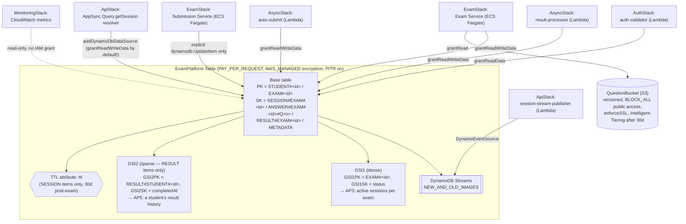

# DataStack — what's configured and why

`lib/stacks/data-stack.ts` owns the platform's only two pieces of persistent state: the
`ExamPlatform` single-table DynamoDB table and the question/upload S3 bucket. It deploys second
(`network → data → auth → ...`) specifically because `AuthStack`'s authorizer needs `table` to
check for an active session — see `CLAUDE.md`'s "Stack Dependencies" note. This doc walks
through every setting in the file and why it's that way rather than the obvious alternative.

Diagram: [`data-stack.drawio`](./data-stack.drawio) (open at app.diagrams.net or the VS Code
Draw.io extension) — Mermaid equivalent at the bottom of this file.

---

## Single table, not one table per entity

```typescript
this.table = new dynamodb.Table(this, 'ExamPlatformTable', {
  tableName: 'ExamPlatform',
  partitionKey: { name: 'PK', type: dynamodb.AttributeType.STRING },
  sortKey: { name: 'SK', type: dynamodb.AttributeType.STRING },
  ...
});
```

Every access pattern this platform has is scoped to `studentId` + `examId` (CONTEXT.md §4.3,
AP1–AP5): get a session, list a student's answers for an exam, get a result, list a student's
result history. A `SESSION`, its `ANSWER`s, and its `RESULT` all share the partition key
`STUDENT#<id>` and differ only by sort key prefix (`SESSION#EXAM#<id>`,
`ANSWER#EXAM#<id>#Q<num>`, `RESULT#EXAM#<id>`) — which means "give me everything about this
student's attempt at this exam" is **one `Query` call** with a `begins_with` on `SK`, not a join
across tables. The generic `PK`/`SK` names (rather than `studentId`/`examId` literal columns) are
what make that possible: the same two physical attributes mean something different depending on
which item type is stored under them (`EXAM#<id>` / `METADATA` for exam metadata, for instance),
which is the defining trade of single-table design — fewer tables and fewer round trips, at the
cost of the table no longer being self-describing from its schema alone. `Type` is stored on
every item (`SESSION`, `ANSWER`, `RESULT`, `EXAM`) precisely to compensate for that — see
`lambda/result-processor/index.js`'s and `lambda/session-stream-publisher/index.js`'s use of it
to filter Stream records, and `CLAUDE.md`'s "DynamoDB — Single Table" rule against adding a
second table without discussion.

## `PAY_PER_REQUEST`, not provisioned capacity

```typescript
billingMode: dynamodb.BillingMode.PAY_PER_REQUEST,
```

Exam traffic is inherently bursty — near-zero most of the day, then every enrolled student hits
"start exam" within the same scheduled window, auto-saves every few seconds for the duration,
then everyone submits near the same end time. Provisioned capacity would mean either
over-provisioning for a peak that lasts a fraction of the day (paying for idle capacity
constantly) or under-provisioning and getting throttled exactly when it matters most. On-demand
billing scales to that burst automatically with no capacity planning, at the cost of a less
predictable bill — a trade CONTEXT.md's trade-offs table (§14) calls out explicitly: "Cost spikes
at peak vs predictable PROVISIONED."

## Encryption: `AWS_MANAGED`, not a customer KMS key

```typescript
encryption: dynamodb.TableEncryption.AWS_MANAGED,
```

This gets every item encrypted at rest with no extra resource to deploy, no key policy to write,
and no per-request KMS API cost. A customer-managed key would only earn its keep if something
here needed key rotation control, cross-account key sharing, or an audit trail of *which* key
decrypted *which* item — none of which this platform's threat model currently calls for. The S3
bucket below makes the identical choice (`s3.BucketEncryption.S3_MANAGED`) for the same reason.

## Point-in-time recovery: on everywhere, not just prod

```typescript
pointInTimeRecoverySpecification: { pointInTimeRecoveryEnabled: true },
```

Unlike `removalPolicy` (below), PITR is **not** gated on `isProd` — it's on in dev and staging
too. The asymmetry is deliberate: `removalPolicy`/`autoDeleteObjects` decide whether `cdk
destroy` is allowed to discard everything, which dev/staging should allow freely; PITR decides
whether a bad deploy, an application bug, or a fat-fingered `UpdateItem` can be undone with a
restore-to-point-in-time, which is just as useful while iterating in dev as it is in prod — it
costs nothing to enable and there's no scenario where you'd want continuous backups *off*.

## Streams: `NEW_AND_OLD_IMAGES`, not `NEW_IMAGE` or `KEYS_ONLY`

```typescript
stream: dynamodb.StreamViewType.NEW_AND_OLD_IMAGES,
```

`api-stack.ts`'s `session-stream-publisher` Lambda reads this stream to push real-time session
updates to AppSync subscribers (`lib/appsync/schema.graphql`'s `onSessionUpdated`) — it only
needs the new item state, which `NEW_IMAGE` alone would cover. `OLD_AND_NEW_IMAGES` is one notch
more than that function strictly needs today, kept deliberately so a future consumer that needs
to diff what changed (e.g. an audit-log Lambda, or a future "notify on status transition into
GRADING specifically" rule) doesn't require a table replacement to add — `streamViewType` can't
be changed without recreating the table, so this is one of the few settings on this table worth
over-provisioning slightly rather than tightening to exactly today's need. `KEYS_ONLY` was never
viable: the publisher needs `status`/`timeRemaining`/`answeredCount`, not just `PK`/`SK`.

## TTL: `ttl`, set only on `SESSION` items

```typescript
timeToLiveAttribute: 'ttl',
```

This just names *which* attribute DynamoDB watches for expiry — it doesn't, by itself, put a TTL
on every item. Per CONTEXT.md §4.5, only `SESSION` items get a `ttl` value (30 days after the
exam ends — see `services/exam-service`'s `ExamSessionService.startExam`, which sets
`ttl = endTime + 30 days`). `RESULT`, `ANSWER`, and `EXAM#METADATA` items are written with no
`ttl` attribute at all, so DynamoDB's background TTL sweep never touches them — a student's
score history and the exam's question metadata need to outlive the 30-day session-cleanup
window indefinitely. Naming the attribute `ttl` (lowercase, generic) rather than something
session-specific keeps the door open to add TTL to another item type later without renaming
anything on the table itself.

## GSI1: dense index, all sessions for an exam

```typescript
this.table.addGlobalSecondaryIndex({
  indexName: 'GSI1',
  partitionKey: { name: 'GSI1PK', type: dynamodb.AttributeType.STRING },
  sortKey: { name: 'GSI1SK', type: dynamodb.AttributeType.STRING },
  projectionType: dynamodb.ProjectionType.ALL,
});
```

This is the only access pattern (AP3) that needs to query *across* students — "show an admin
every active session for exam 456" can't be answered by the base table, since the base table's
partition key is `STUDENT#<id>`, not `EXAM#<id>`. GSI1 inverts that: `GSI1PK = EXAM#<id>`,
`GSI1SK = status`. It's a **dense** index — every `SESSION` item sets `GSI1PK`/`GSI1SK`
unconditionally (`ExamSessionService.startExam` sets `GSI1PK`/`GSI1SK` on every session it
creates) — because every session, not just some subset, is a candidate for "is this exam session
currently active."

## GSI2: sparse index, student result history only

```typescript
this.table.addGlobalSecondaryIndex({
  indexName: 'GSI2',
  partitionKey: { name: 'GSI2PK', type: dynamodb.AttributeType.STRING },
  sortKey: { name: 'GSI2SK', type: dynamodb.AttributeType.STRING },
  projectionType: dynamodb.ProjectionType.ALL,
});
```

This is the opposite design: **sparse**. `GSI2PK`/`GSI2SK` are only ever set on `RESULT` items
(`lambda/result-processor/index.js` is the only writer, and it sets
`GSI2PK = RESULT#STUDENT#<id>`, `GSI2SK = completedAt` on every result it writes) — `SESSION` and
`ANSWER` items never populate these attributes, so they simply don't appear in this index at all.
DynamoDB only indexes items that have *both* the GSI's key attributes present, so a sparse index
costs nothing in size or read cost for the item types that don't need it, while still giving "all
of this student's results, most recent first" (AP5, via `ScanIndexForward: false` at query time)
as a single, cheap `Query`. Both GSIs use `ProjectionType.ALL` rather than `KEYS_ONLY`/`INCLUDE`
because every consumer of either index (the admin monitoring view via GSI1, the result-history
view via GSI2) wants the full item back, not just keys it would then have to re-fetch from the
base table with a second round trip — `ALL` trades GSI storage cost (you're storing the item
twice) for guaranteeing every query against either index is one request, not two.

## `removalPolicy` / `autoDeleteObjects`: flipped by environment

```typescript
const isProd = props.envConfig.envName === 'prod';
// ...
removalPolicy: isProd ? cdk.RemovalPolicy.RETAIN : cdk.RemovalPolicy.DESTROY,
// (bucket only) autoDeleteObjects: !isProd,
```

In prod, `cdk destroy` must never silently delete a table full of real student exam history or a
bucket full of the live question bank — `RETAIN` makes CloudFormation orphan the resource
instead of deleting it, so destroying the stack can't destroy the data. In dev/staging, the
opposite default is more useful: those environments get torn down and rebuilt routinely while
iterating, and `DESTROY` (plus `autoDeleteObjects: true`, since S3 refuses to delete a non-empty
bucket otherwise) means `cdk destroy` actually finishes instead of failing on a non-empty bucket
or leaving orphaned resources behind every time.

## S3 bucket: name, encryption, public access, lifecycle

```typescript
this.questionBucket = new s3.Bucket(this, 'QuestionBucket', {
  bucketName: `exam-platform-questions-${props.envConfig.envName}-${cdk.Aws.ACCOUNT_ID}`,
  versioned: true,
  encryption: s3.BucketEncryption.S3_MANAGED,
  blockPublicAccess: s3.BlockPublicAccess.BLOCK_ALL,
  enforceSSL: true,
  lifecycleRules: [{ transitions: [{ storageClass: s3.StorageClass.INTELLIGENT_TIERING, transitionAfter: cdk.Duration.days(30) }] }],
  ...
});
```

- **Bucket name includes `${envName}-${cdk.Aws.ACCOUNT_ID}`.** S3 bucket names are unique
  *globally*, across every AWS account that exists — `exam-platform-questions-dev` with no
  further qualifier risks colliding with some unrelated AWS customer's bucket of the same name
  (bucket name squatting is a real, documented S3 gotcha). Account ID makes the name unique by
  construction; `envName` keeps dev/staging/prod from colliding with *each other* if they're
  ever deployed into the same account for testing, even though §9's intent is one account per
  environment.
- **`versioned: true`.** Question content is exactly the kind of thing where "someone uploaded a
  corrected version of EXAM#456's question 12, the previous version had a typo or a wrong answer
  key entry" needs a recovery path. Versioning means the previous object is still retrievable,
  not silently gone.
- **`blockPublicAccess: BLOCK_ALL` + `enforceSSL: true`.** This bucket holds exam questions
  *before* the exam window — public readability would leak the question bank to anyone who
  enumerates or guesses an object key, defeating exam integrity (a goal the platform takes
  seriously enough to have its own WAF Web ACL — see `docs/architecture.md`). `enforceSSL` adds
  a bucket policy statement that denies any request not made over HTTPS, closing the one gap
  `BLOCK_ALL` doesn't cover (a plaintext HTTP request from inside the VPC, say).
- **`INTELLIGENT_TIERING` after 30 days, not `GLACIER`.** Once an exam's window has passed, its
  questions stop being read frequently — but they're not *never* read again: a re-take, an appeal,
  or an audit could need to pull a specific question back up with no advance notice. Glacier's
  retrieval delay (minutes to hours) is the wrong trade for that; Intelligent-Tiering moves
  infrequently-accessed objects to a cheaper tier automatically while keeping millisecond
  retrieval the whole time, costing nothing extra if an object turns out to still be accessed
  often.

## `CfnOutput`s and cross-stack consumers

Like `network-stack.ts`, every output here (`TableArn`, `TableName`, `TableStreamArn`,
`QuestionBucketArn`, `QuestionBucketName`) is documentation/ops tooling with an explicit
`exportName` — the real wiring is `bin/app.ts` passing `data.table` / `data.questionBucket`
directly as typed props. What actually reads/writes this table and bucket, by stack:

| Stack | Resource | Access | Why that access level |
|---|---|---|---|
| `AuthStack` | table | `grantReadData` | `auth-validator` only ever checks whether a session is active — never writes |
| `AsyncStack` | table | `grantReadWriteData` ×2 | `result-processor` writes `RESULT` + flips `SESSION` status; `auto-submit` reads `SESSION` then marks it `EXPIRED` |
| `ExamStack` | table | `grantReadWriteData` (Exam Service) | full session/answer CRUD — starting, auto-saving, reading session state |
| `ExamStack` | table | explicit `dynamodb:UpdateItem` only (Submission Service) | the *only* thing Submission Service does to this table is flip `SESSION.status` to `SUBMITTED` — `grantReadWriteData` would over-grant `GetItem`/`Query`/`PutItem`/`DeleteItem` it never calls |
| `ExamStack` | bucket | `grantRead` (Exam Service only) | Exam Service serves question content; nothing else in the platform reads the bucket, and nothing writes to it from application code (question upload is an out-of-band admin/CMS concern, not modeled here) |
| `ApiStack` | table | `addDynamoDbDataSource` (AppSync) — **grants `grantReadWriteData`**, not read-only | the only resolver actually attached is `Query.getSession` (a `GetItem`) — `addDynamoDbDataSource(id, table)` defaults to read+write unless you pass `readOnlyAccess: true`, so this data source's IAM role can write to the table even though nothing in `lib/appsync/resolvers/get-session.js` does. A real least-privilege gap worth tightening if another resolver isn't added to this data source later: `api.addDynamoDbDataSource('SessionTableDataSource', props.table, { readOnlyAccess: true })`. |
| `ApiStack` | table (Streams) | `DynamoEventSource` (Lambda) | `session-stream-publisher`'s trigger — the L2 construct auto-grants `dynamodb:DescribeStream`/`GetRecords`/`GetShardIterator` scoped to the stream ARN, plus `dynamodb:ListStreams` (that one's only resource-scopable to `*`, not the stream ARN — DynamoDB's API doesn't support narrowing it further); nothing on the table's items themselves |
| `MonitoringStack` | table | none (CloudWatch metrics only) | `metricConsumedReadCapacityUnits`/`metricConsumedWriteCapacityUnits`/`ThrottledRequests` read the `AWS/DynamoDB` metric namespace by table name — no table-level IAM grant needed |

The submission-service row (and the AppSync one) are worth remembering if you're extending this
stack: when a service's actual DynamoDB usage is narrower than `grantReadWriteData`'s blanket
`GetItem`/`PutItem`/`UpdateItem`/`DeleteItem`/`Query`/`Scan`/etc., write the explicit
`iam.PolicyStatement` (or pass the construct's own narrowing option, like `readOnlyAccess`)
instead — see `exam-stack.ts`'s submission service task role for the
pattern.

## Tags

```typescript
cdk.Tags.of(this).add('Project', 'ExamPlatform');
cdk.Tags.of(this).add('Environment', props.envConfig.envName);
```

Same pattern as `network-stack.ts` — applied at the stack level so the table, both GSIs (GSIs
inherit the table's tags, they don't get their own), and the bucket are all tagged consistently
without repeating the two `Tags.of()` calls per resource.

---

## Diagram (Mermaid)


