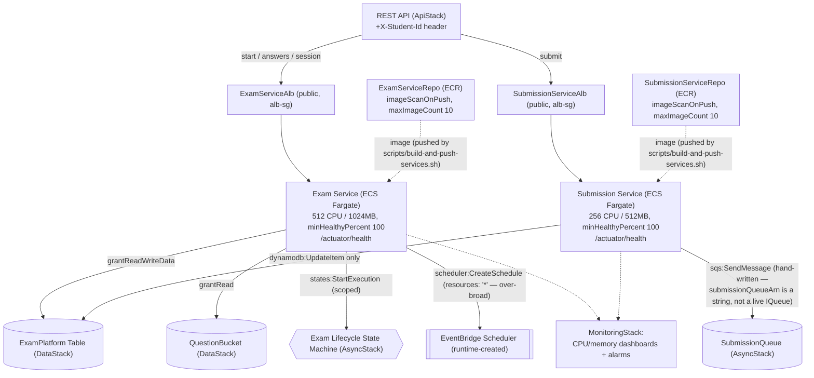

# ExamStack — what's configured and why

`lib/stacks/exam-stack.ts` owns the platform's only two long-running services — Exam Service and
Submission Service, both Java 21 / Spring Boot on ECS Fargate (`services/exam-service`,
`services/submission-service`) — plus their ECR repos, ALBs, auto-scaling, and the IAM each
service's task role actually needs. It deploys fifth (`network → data → auth → async → exam →
waf/api → monitoring`), after `AsyncStack` (it needs `stateMachineArn`, `submissionQueueUrl`/`Arn`,
`schedulerExecutionRoleArn`, `autoSubmitFunctionArn`) and before `ApiStack` (which needs both
ALBs' DNS names to build its REST API integrations).

Diagram: [`exam-stack.drawio`](./exam-stack.drawio) (open at app.diagrams.net or the VS Code
Draw.io extension) — Mermaid equivalent at the bottom of this file.

---

## ECS Cluster: just a namespace, with Container Insights on

```typescript
this.cluster = new ecs.Cluster(this, 'ExamPlatformCluster', {
  clusterName: 'ExamPlatformCluster',
  vpc: props.vpc,
  containerInsightsV2: ecs.ContainerInsights.ENABLED,
});
```

A Fargate cluster has no capacity of its own to configure (no EC2 instances, no capacity
providers to size) — it's purely a grouping construct both services register into.
`containerInsightsV2: ENABLED` turns on the per-task/per-service CPU, memory, network, and
storage metrics `monitoring-stack.ts` reads (`metricCpuUtilization`/`metricMemoryUtilization` on
both services' dashboard widgets) — without it, ECS still emits its own coarser service-level
metrics, but not the finer task-level breakdown Container Insights adds.

## ECR repos: CDK creates them, but never builds or pushes into them

```typescript
const isProd = props.envConfig.envName === 'prod';
const examServiceRepo = new ecr.Repository(this, 'ExamServiceRepo', {
  repositoryName: 'exam-service',
  imageScanOnPush: true,
  lifecycleRules: [{ maxImageCount: 10 }],
  removalPolicy: isProd ? cdk.RemovalPolicy.RETAIN : cdk.RemovalPolicy.DESTROY,
  emptyOnDelete: !isProd,
});
// (submissionServiceRepo: identical shape)
```

- **CDK creates the repo (`new ecr.Repository`), not `ecr.Repository.fromRepositoryName`.** An
  earlier version of this stack only referenced these repos by name, assuming they already
  existed — but nothing else in this CDK app ever created them, so that assumption had no actual
  resource backing it. Creating them here makes the stack self-sufficient: `cdk deploy` alone is
  enough to get an empty-but-real repo, with the actual image push handled separately by
  `scripts/build-and-push-services.sh` (see `docs/deploying-services.md`). Deliberately **not**
  `ecs.ContainerImage.fromAsset()` (which would build the Docker image as part of `cdk
  synth`/`deploy`) — see `CLAUDE.md`'s ECS Fargate section for why: that would force a full
  Maven+JRE Docker build into every `cdk synth`, including the Jest test suite.
- **`imageScanOnPush: true`** runs Amazon ECR's basic vulnerability scan automatically on every
  push — catches known-CVE base images before they ever reach a running task, at no extra
  per-push cost for basic scanning.
- **`lifecycleRules: [{ maxImageCount: 10 }]`** keeps only the 10 most recent images, expiring
  older ones automatically. Without this, every `docker push` from
  `build-and-push-services.sh` (run on every app code change, since there's no CI pipeline yet —
  see `docs/deploying-services.md`) accumulates forever, an unbounded and easy-to-forget storage
  cost for images nobody will ever roll back to.
- **`removalPolicy`/`emptyOnDelete` flipped by `isProd`** — same reasoning as every other
  stateful resource in this app (`docs/data-stack.md`'s table/bucket, `docs/auth-stack.md`'s user
  pool): prod must never have its repo (and the only known-good image in it) silently deleted by
  `cdk destroy`; dev/staging should tear down cleanly without manual cleanup.

## Two ALBs, sharing `NetworkStack`'s `alb-sg` — not two ad-hoc security groups

```typescript
const examAlb = new elbv2.ApplicationLoadBalancer(this, 'ExamServiceAlb', {
  vpc: props.vpc,
  internetFacing: true,
  securityGroup: props.albSecurityGroup,
});
// (submissionAlb: identical shape)
```

Each service gets its **own** ALB rather than one shared ALB with path-based listener rules —
this maps directly onto how `api-stack.ts` already splits traffic: `start`/`answers`/`session`
go to Exam Service's ALB, `submit` goes to Submission Service's ALB
(`examServiceAlbDns`/`submissionServiceAlbDns`, two separate `HttpIntegration`s). Two ALBs cost
more than one, but let each service scale, health-check, and (if ever needed) get its own
listener rules/certificates completely independently, with no shared blast radius. Both ALBs are
built **explicitly** here and passed in via `loadBalancer: examAlb` (rather than letting
`ApplicationLoadBalancedFargateService` auto-create one per service) specifically so both use
`props.albSecurityGroup` — the *same* `NetworkStack`-owned security group on both ends. See
`docs/network-stack.md`'s cross-stack handoff section for the cyclic-dependency this avoids: if
either ALB got an auto-created, `ExamStack`-owned security group instead, the pattern's automatic
ALB↔task ingress-rule wiring would try to add a rule onto `NetworkStack`'s `ecsSecurityGroup`
sourced from an `ExamStack` security group — a `Network → Exam` dependency on top of the existing
`Exam → Network` one, which CDK refuses to synthesize.

## Exam Service: sizing, health checks, and IAM

```typescript
this.examService = new ecs_patterns.ApplicationLoadBalancedFargateService(this, 'ExamService', {
  cpu: 512,
  memoryLimitMiB: 1024,
  desiredCount: props.envConfig.examServiceMinCapacity,
  minHealthyPercent: 100,
  securityGroups: [props.ecsSecurityGroup],
  loadBalancer: examAlb,
  taskImageOptions: { containerPort: 8080, ... },
  healthCheckGracePeriod: cdk.Duration.seconds(60),
});
this.examService.targetGroup.configureHealthCheck({ path: '/actuator/health' });
```

- **`cpu: 512` / `memoryLimitMiB: 1024`** — double Submission Service's allocation (below),
  proportionate to its workload: Exam Service fronts 3 of the platform's 4 REST routes
  (`start`/`answers`/`session`) and does meaningfully more per request (a DynamoDB
  read-then-write, an S3 read, and — on `start` — a Step Functions `StartExecution` plus an
  EventBridge Scheduler `CreateSchedule` call). Submission Service does one thing: flip a status
  attribute and enqueue an SQS message.
- **`minHealthyPercent: 100`.** ECS's rolling-deployment default lets the running task count drop
  to 50% of desired while new tasks come up — fine for a low-traffic service, but this one can be
  serving live exam traffic during a deploy. `100` means ECS won't stop any existing task until
  an equivalent replacement is already healthy (it temporarily runs *above* desired count instead,
  up to the default `maxHealthyPercent` of 200%) — capacity never dips during a rollout.
- **`securityGroups: [props.ecsSecurityGroup]`** — the same `NetworkStack`-owned group both
  services use, since both trust the identical source (`alb-sg`) on the identical port (`8080`);
  no need for a second, near-duplicate security group per service.
- **`containerPort: 8080`** matches `services/exam-service/src/main/resources/application.yml`'s
  `server.port: 8080` exactly — a mismatch here would mean the ALB's target group health checks
  and traffic would never reach the container's actual listening port.
- **`healthCheckGracePeriod: 60s`.** A Spring Boot app needs real time to start (JVM boot, Spring
  context initialization, this app's `AwsClientConfig` beans) before it can answer
  `/actuator/health` — without a grace period, the ALB could mark a just-launched, still-starting
  task unhealthy and have ECS kill and restart it in a loop, never giving it the chance to finish
  starting.
- **Environment variables** (`TABLE_NAME`, `QUESTION_BUCKET`, `STATE_MACHINE_ARN`,
  `SCHEDULER_EXECUTION_ROLE_ARN`, `AUTO_SUBMIT_FUNCTION_ARN`) map 1:1 onto
  `ExamPlatformProperties`'s `@ConfigurationProperties(prefix = "examplatform")` bindings in
  `application.yml` — see `docs/data-stack.md`/`docs/async-stack.md` for what each one is used for.

### Exam Service IAM — one grant worth tightening

```typescript
props.table.grantReadWriteData(this.examService.taskDefinition.taskRole);
props.questionBucket.grantRead(this.examService.taskDefinition.taskRole);
// states:StartExecution, scoped to props.stateMachineArn — correctly narrow
// scheduler:CreateSchedule/DeleteSchedule/UpdateSchedule, resources: ['*']
// iam:PassRole, scoped to props.schedulerExecutionRoleArn — correctly narrow
```

`grantReadWriteData`/`grantRead` are justified here (unlike a couple of narrower-than-default
grants noted in `docs/data-stack.md`) — `ExamSessionService` genuinely does full session/answer
CRUD plus reads the question bank. `states:StartExecution` and `iam:PassRole` are both correctly
scoped to the *one* specific ARN each call actually needs. The **`scheduler:*Schedule` actions on
`resources: ['*']`** are looser than necessary: `ExamSessionService.scheduleAutoSubmit` always
names its schedules deterministically (`scheduleSafeName("auto-submit", studentId, examId)`),
so this could be scoped to `arn:aws:scheduler:<region>:<account>:schedule/default/auto-submit-*`
instead of every schedule in the account — `CreateSchedule` genuinely can't be scoped any tighter
(the schedule doesn't exist yet to have an ARN), but `UpdateSchedule`/`DeleteSchedule` could be.
Same family of gap as `docs/async-stack.md`'s `auto-submit` grant and `docs/data-stack.md`'s
`addDynamoDbDataSource` default — worth tightening if this stack is extended.

## Submission Service: lighter sizing, and why its SQS grant looks different

```typescript
this.submissionService = new ecs_patterns.ApplicationLoadBalancedFargateService(this, 'SubmissionService', {
  cpu: 256,
  memoryLimitMiB: 512,
  desiredCount: props.envConfig.submissionServiceMinCapacity,
  minHealthyPercent: 100,
  ...
});

new iam.Policy(this, 'SubmissionServiceQueuePolicy', {
  statements: [new iam.PolicyStatement({ actions: ['sqs:SendMessage'], resources: [props.submissionQueueArn] })],
}).attachToRole(this.submissionService.taskDefinition.taskRole);
this.submissionService.taskDefinition.taskRole.addToPrincipalPolicy(
  new iam.PolicyStatement({ actions: ['dynamodb:UpdateItem'], resources: [props.table.tableArn] }),
);
```

- **`cpu: 256` / `memoryLimitMiB: 512`** — half of Exam Service's, matching its much lighter
  per-request work (one `UpdateItem`, one `SendMessage`, no S3, no Step Functions, no Scheduler).
- **The SQS grant is a hand-written `iam.Policy`, not `submissionQueue.grantSendMessages(role)` —
  because there's no live queue object to call that method on here.** `AsyncStack` exports
  `submissionQueueArn` into `ExamStackProps` as a plain `string`, not as an `sqs.IQueue` — unlike
  `table: dynamodb.ITable`, which *is* a live construct reference (which is exactly why
  `props.table.grantReadWriteData(...)` above works as a normal grant call). A bare ARN string
  has no `.grantSendMessages()` method to call, so the only way to grant this permission is to
  write the `iam.PolicyStatement` by hand, scoped to that ARN directly. (`AsyncStack` could have
  exported the live `Queue` object instead of just its ARN — it doesn't, likely to keep
  `ExamStackProps` to plain serializable values for the queue/state-machine/role group of props,
  while `table`/`questionBucket` stayed as live objects since `DataStack` already needed to
  export those as live objects for `AuthStack` too.)
- **`dynamodb:UpdateItem` only, not `grantReadWriteData`.** Submission Service only ever flips
  `SESSION.status` — see `docs/data-stack.md`'s table of per-stack grants for the same pattern
  applied consistently across this codebase.

## Auto-scaling: CPU, request count, and the pre-warm asymmetry

```typescript
scalableTarget.scaleOnCpuUtilization('CpuScaling', { targetUtilizationPercent: 70, scaleInCooldown: 60s, scaleOutCooldown: 60s });
scalableTarget.scaleOnRequestCount('RequestScaling', { requestsPerTarget: opts.scaleOnRequests /* 1000 */, targetGroup });
if (opts.prewarm) {
  scalableTarget.scaleOnSchedule('PrewarmBeforePeak', { schedule: cron({ hour: '8', minute: '45' }), minCapacity: 20 });
  scalableTarget.scaleOnSchedule('ScaleDownAfterPeak', { schedule: cron({ hour: '18', minute: '0' }), minCapacity: opts.min });
}
```

- **Two scaling triggers, not one.** CPU alone can lag for a service that's mostly waiting on
  DynamoDB/S3 I/O rather than burning CPU — request count is a more direct proxy for "this
  service is getting busy" for exactly that kind of workload. Both are active simultaneously;
  whichever fires first scales the service.
- **`targetUtilizationPercent: 70`**, not 90 or 50 — leaves headroom to absorb a burst before a
  new task is needed (scaling out itself takes time: provisioning + the 60s health-check grace
  period above), without provisioning so conservatively that normal load looks "underutilized."
- **`scaleInCooldown`/`scaleOutCooldown: 60s`** — short enough to react to the bursty,
  exam-window-driven traffic pattern this platform expects (CONTEXT.md §3.2's whole reason for
  choosing ECS over Lambda here), long enough to avoid flapping (scaling out, then immediately
  back in, repeatedly) on noisy short-term metric spikes.
- **Pre-warm scheduling is only applied to Exam Service** (`prewarm: true` is passed to
  `configureScaling(this.examService, ...)` but omitted for `this.submissionService`) — and this
  is worth questioning, not just noting. The reasoning for pre-warming at all is "every enrolled
  student hits start within the same scheduled window" (CONTEXT.md §3.2) — true for Exam Service.
  But submissions cluster just as predictably near the *end* of that same window, when everyone
  finishes around the same time — Submission Service is exposed to the identical burst pattern,
  just shifted later, and currently scales reactively from its `minCapacity` baseline with no
  pre-warm cushion. Worth adding `prewarm: true` to Submission Service's `configureScaling` call
  too if this gap matters for a real exam window.
- **Fixed daily cron times (08:45/18:00 UTC), not per-session.** This pre-warms for one
  account-wide "peak exam hours" bracket every day, regardless of when any *specific* exam is
  actually scheduled to start — a deliberate simplification (the alternative, scheduling a
  pre-warm tied to each exam's actual `startWindow`, would need the same kind of per-session
  dynamic scheduling `auto-submit`'s `EventBridge Scheduler` already does, just for scaling
  instead of submission) rather than something this stack currently does.

## `CfnOutput`s and cross-stack consumers

| Consumer | What it gets | Why |
|---|---|---|
| `ApiStack` | `examServiceAlbDns`, `submissionServiceAlbDns` (strings) | Built into `HttpIntegration` URIs for the REST routes — `start`/`answers`/`session` → Exam Service, `submit` → Submission Service. `ApiStack` also maps the Lambda authorizer's `studentId` onto an `X-Student-Id` header on these same integrations — see `docs/auth-stack.md` |
| `MonitoringStack` | `examService`, `submissionService` (live objects) | CPU/memory dashboard widgets and the per-service CPU alarm (`docs/async-stack.md`-style: no IAM grant needed, pure CloudWatch metric reads) |

## Tags

```typescript
cdk.Tags.of(this).add('Project', 'ExamPlatform');
cdk.Tags.of(this).add('Environment', props.envConfig.envName);
```

Same stack-level tagging pattern as every other stack in this app.

---

## Diagram (Mermaid)


