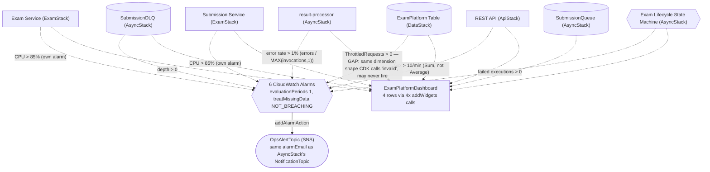

# MonitoringStack — what's configured and why

`lib/stacks/monitoring-stack.ts` is the last stack in the deploy order
(`network → data → auth → async → exam → waf/api → monitoring`) for a structural reason, not just
a narrative one: it's the only stack that needs *live* objects from almost every other stack at
once — `examService`/`submissionService` (ExamStack), `submissionQueue`/`submissionDlq`/
`resultProcessorFn`/`stateMachine` (AsyncStack), `table` (DataStack), `restApi` (ApiStack) — so it
has to come after all of them. Nothing depends on this stack in turn; it's the end of the
dependency chain. This doc walks through every alarm and every dashboard widget, and one real gap
verified directly against the AWS CDK source: a metric this stack relies on is the exact one CDK
itself documents as "invalid."

Diagram: [`monitoring-stack.drawio`](./monitoring-stack.drawio) — Mermaid equivalent at the bottom
of this file.

---

## OpsAlertTopic — and the same email overlap noted in AsyncStack

```typescript
this.opsAlertTopic = new sns.Topic(this, 'OpsAlertTopic', {
  topicName: `${props.envConfig.domainPrefix}-ops-alerts`,
  displayName: 'Exam Platform Ops Alerts',
});
this.opsAlertTopic.addSubscription(new sns_subscriptions.EmailSubscription(props.envConfig.alarmEmail));
const alertAction = new cloudwatch_actions.SnsAction(this.opsAlertTopic);
```

This is a genuinely separate SNS topic from `AsyncStack`'s `NotificationTopic` — but both
subscribe the *same* `props.envConfig.alarmEmail` address (see `docs/async-stack.md`'s note on
this). In a real deployment, "your exam result is ready" and "the DLQ depth alarm fired" land in
the same inbox, distinguishable only by subject line. `SnsAction` is just an adapter: CloudWatch
Alarms need an `IAlarmAction`, not a raw SNS topic, to attach as an action — this wraps the topic
so every `.addAlarmAction(action)` call below can reuse the same instance.

## The six alarms — and a metric that doesn't actually report what it claims to

Every alarm shares three settings worth calling out once instead of six times:

- **`evaluationPeriods: 1`** — a single breaching period is enough to alarm, no requirement for
  sustained breaches across multiple periods. For the threshold-`0` alarms below (DLQ depth,
  DynamoDB throttles, Step Functions failures), that's the right call — a single DLQ message or a
  single failed execution is inherently meaningful, not noise to filter out by waiting for a
  second occurrence. For the CPU and error-rate alarms, this is a real trade-off: a single 5-minute
  window with one CPU spike to 86% pages ops immediately, with no "did this resolve itself"
  grace period — faster detection, more exposure to noise from transient blips, deliberately.
- **`treatMissingData: NOT_BREACHING`** — if a metric simply doesn't publish data for a period
  (genuinely idle traffic at 3am, not a failure), the alarm stays OK rather than flipping to ALARM
  just because there's nothing to evaluate. Without this, every alarm here would default to
  `MISSING` data being treated as breaching, paging ops during quiet periods when nothing is
  actually wrong.
- **`addAlarmAction(action)`** — every alarm notifies the same `OpsAlertTopic`; none of these
  alarms currently distinguish "page someone now" from "just log it," a reasonable simplification
  at this scope but worth knowing if alarm fatigue ever becomes a real problem (CloudWatch Alarms
  support separate `okAction`/`insufficientDataAction` too, neither configured here).

```typescript
props.submissionDlq.metricApproximateNumberOfMessagesVisible({ period: cdk.Duration.minutes(1) })
  .createAlarm(this, 'DlqDepthAlarm', { threshold: 0, ... });
```

**DLQ depth, threshold 0.** The DLQ should be empty in healthy operation — `SubmissionQueue`
only routes a message here after `result-processor` fails to process it three times (see
`docs/async-stack.md`). Any message at all is a real signal, not noise.

```typescript
const resultProcessorErrorRate = new cloudwatch.MathExpression({
  expression: '(errors / MAX([invocations, 1])) * 100',
  usingMetrics: { errors: ..., invocations: ... },
});
```

**`MAX([invocations, 1])`, not just `invocations`, as the divisor.** If `result-processor` simply
wasn't invoked at all in a 5-minute window (no submissions to grade), `invocations` is `0` —
dividing by zero would make this expression undefined/`NaN`, which CloudWatch would likely treat
unpredictably. Flooring the divisor at `1` makes a quiet period evaluate to `0/1 = 0%` — correctly
"no errors," not a math error. **`threshold: 1`** (1%) means even an occasional single-invocation
failure trips this if it happens to be that period's only invocation (`1 error / 1 invocation =
100%`) — a known sensitivity of "rate over a small sample," not a bug, but worth knowing before
treating every fire of this alarm as "the service is broadly unhealthy."

```typescript
for (const [name, service] of [['ExamService', props.examService], ['SubmissionService', props.submissionService]] as const) {
  service.service.metricCpuUtilization({ period: cdk.Duration.minutes(5) })
    .createAlarm(this, `${name}CpuAlarm`, { threshold: 85, ... });
}
```

**Two separate alarms, not one.** Each service's CPU metric is scoped to its own ECS service
name dimension — there's no single combined "platform CPU" metric to alarm on, so this loops over
both and creates one alarm per service rather than trying to average or combine them, matching
`docs/exam-stack.md`'s reasoning for why each service scales independently too.

```typescript
props.restApi.metricServerError({ period: cdk.Duration.minutes(1), statistic: 'Sum' })
  .createAlarm(this, 'ApiGateway5xxAlarm', { threshold: 10, ... });
```

**`statistic: 'Sum'`, not the metric's default (`Average`).** `metricServerError` is a per-request
count — averaging a count across a 1-minute window answers a different question ("what's the
typical per-datapoint count") than what this alarm actually wants ("how many 5xx responses
happened, total, in this window"). `Sum` over `threshold: 10` matches CONTEXT.md §7.7's literal
"API Gateway 5xx > 10 in 1 minute."

```typescript
new cloudwatch.Alarm(this, 'DynamoDbThrottleAlarm', {
  metric: new cloudwatch.Metric({
    namespace: 'AWS/DynamoDB',
    metricName: 'ThrottledRequests',
    dimensionsMap: { TableName: props.table.tableName },
    statistic: 'Sum',
    period: cdk.Duration.minutes(1),
  }),
  threshold: 0,
  ...
});
```

**This is hand-built instead of calling `props.table.metricThrottledRequests(...)` — and that
choice doesn't actually dodge the problem it looks like it's avoiding.** `dynamodb.ITable` does
expose a `metricThrottledRequests()` helper, but it's `@deprecated` in the CDK source itself, with
this exact message: *"Do not use this function. It returns an invalid metric. Use
`metricThrottledRequestsForOperation` instead."* Checking what that deprecated helper actually
does under the hood: it calls `this.metric("ThrottledRequests", { statistic: "sum", ...props })`,
which resolves to `new cloudwatch.Metric({ namespace: "AWS/DynamoDB", metricName:
"ThrottledRequests", dimensionsMap: { TableName: this.tableName }, ...props })` — **the identical
namespace, metric name, and dimensions** this stack constructs by hand. Avoiding the deprecated
*method* didn't avoid the underlying *metric definition* CDK is warning about — `ThrottledRequests`
queried with only a `TableName` dimension (no `Operation`) is the specific combination AWS
doesn't reliably populate; CDK's own recommended fix is
`metricThrottledRequestsForOperations({ operations: [...] })`, which sums the metric across an
explicit list of operations (e.g. `GetItem`, `PutItem`, `UpdateItem`, `Query` — the ones this
platform's Lambdas and Spring Boot services actually call). As configured today, this alarm may
simply never fire even during real throttling, and `treatMissingData: NOT_BREACHING` means that
failure mode is silent — it looks "OK" on the dashboard for the same reason a healthy table would.
This is the most concrete, verifiable gap in this stack — worth fixing before relying on this
specific alarm.

```typescript
new cloudwatch.Alarm(this, 'StateMachineFailedAlarm', {
  metric: props.stateMachine.metricFailed({ period: cdk.Duration.minutes(1), statistic: 'Sum' }),
  threshold: 0,
  ...
});
```

`metricFailed` is a real, non-deprecated `IStateMachine` helper — no equivalent issue here.
Threshold `0` for the same reason as the DLQ alarm: any failed execution is meaningful (though
see `docs/async-stack.md`'s state-machine race-condition note — if that gap is ever exercised
end-to-end, this alarm is one of the things that would actually surface it).

## The dashboard: four rows, by how `addWidgets` actually works

```typescript
const dashboard = new cloudwatch.Dashboard(this, 'ExamPlatformDashboard', { dashboardName: 'ExamPlatformDashboard' });
dashboard.addWidgets(/* ECS CPU */, /* ECS Memory */);
dashboard.addWidgets(/* SQS Queue Depth */, /* DynamoDB Consumed Capacity */);
dashboard.addWidgets(/* Lambda Errors */, /* API Gateway 4xx/5xx */);
dashboard.addWidgets(/* Step Functions Failures */ /* width: 12 */);
```

`Dashboard.addWidgets(...)` lays its arguments out left-to-right in a single row; calling it
**again** starts a new row below the previous one. The four separate calls here aren't arbitrary
— they're literally how this dashboard's 4-row layout (CPU+Memory / Queue+Capacity / Errors+4xx5xx
/ Step Functions alone) is expressed; one call with all 7 widgets would instead pack them into as
few rows as fit, in whatever order CloudWatch's grid-fill happens to choose. `GraphWidget`
defaults to `width: 6` on CloudWatch's 24-column grid, so each two-widget row only fills 12 of 24
columns (6+6), leaving the right half of the dashboard blank by default. The final widget's
explicit **`width: 12`** isn't "make this one extra wide" so much as "match the same 12-column
total every other row already uses" — without it, that last row would default to a *narrower*
6-column widget, visually inconsistent with the three rows above it rather than matching them.

## `CfnOutput`s

```typescript
new cdk.CfnOutput(this, 'OpsAlertTopicArn', { ... });
new cdk.CfnOutput(this, 'DashboardName', { ... });
```

Same documentation/ops-tooling pattern as every other stack — `DashboardName` is mostly useful as
a direct link target (`https://<region>.console.aws.amazon.com/cloudwatch/home?region=<region>#dashboards:name=ExamPlatformDashboard`),
`OpsAlertTopicArn` for anyone who wants to subscribe additional endpoints (a Slack webhook, a
second on-call email) beyond the one `alarmEmail` address baked in at synth time.

## Tags

```typescript
cdk.Tags.of(this).add('Project', 'ExamPlatform');
cdk.Tags.of(this).add('Environment', props.envConfig.envName);
```

Same stack-level tagging pattern as every other stack in this app (the one exception across the
whole platform being `WafStack` — see `docs/waf-stack.md`).

---

## Diagram (Mermaid)


