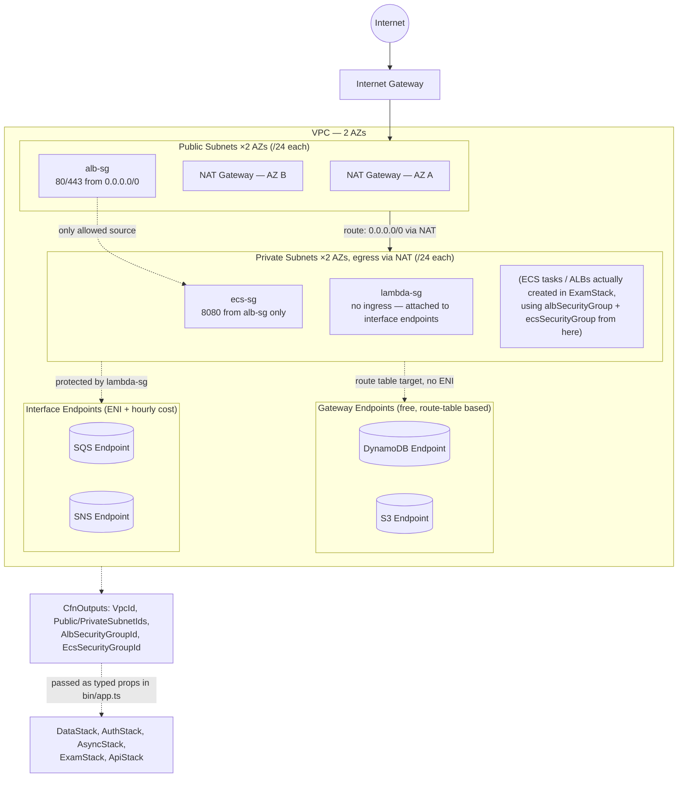

# NetworkStack — what's configured and why

`lib/stacks/network-stack.ts` is the first stack in the deploy order (`network → data → auth →
async → exam → waf/api → monitoring` — see `CLAUDE.md`). It owns nothing application-specific;
it just builds the VPC, subnets, security groups, and VPC endpoints that every other stack either
deploys into or borrows a security group from. This doc walks through every resource in that file
and the reasoning behind its specific settings — not just *what* it does, but *why it's set up
this particular way* instead of the obvious alternatives.

Diagram: [`network-stack.drawio`](./network-stack.drawio) (open at app.diagrams.net or the
VS Code Draw.io extension) — Mermaid equivalent at the bottom of this file.

---

## The VPC: 2 AZs, public + private subnets, `/24` each

```typescript
this.vpc = new ec2.Vpc(this, 'ExamPlatformVpc', {
  maxAzs: 2,
  natGateways: props.envConfig.natGatewayCount,
  subnetConfiguration: [
    { name: 'Public', subnetType: ec2.SubnetType.PUBLIC, cidrMask: 24 },
    { name: 'Private', subnetType: ec2.SubnetType.PRIVATE_WITH_EGRESS, cidrMask: 24 },
  ],
});
```

- **`maxAzs: 2`, not 1 or 3.** One AZ means an AZ outage takes the whole platform down during an
  exam window — unacceptable for something graded and time-boxed. Three AZs is the next step up
  in resilience but costs a third NAT Gateway and a third set of subnets for marginal benefit at
  this scale; two AZs is the standard "highly available, not over-engineered" baseline AWS itself
  recommends for ALB-backed services (an ALB requires subnets in **at least 2 AZs** to register
  targets at all, so 2 is also the practical minimum, not an arbitrary choice).
- **`PUBLIC` + `PRIVATE_WITH_EGRESS`, not `PRIVATE_ISOLATED`.** The ALBs that front Exam Service
  and Submission Service (created in `exam-stack.ts`, using this stack's `albSecurityGroup`) must
  sit in public subnets to be reachable from the internet. The ECS tasks behind them must be able
  to *call out* — to DynamoDB, S3, SQS, SNS, Step Functions, EventBridge Scheduler, none of which
  are reachable without either a NAT Gateway or a VPC endpoint — but must never accept inbound
  connections directly from the internet. `PRIVATE_WITH_EGRESS` is exactly that: a route table
  pointed at a NAT Gateway for outbound, no route for inbound. `PRIVATE_ISOLATED` (no egress at
  all) would have blocked every one of those AWS API calls unless every single one had a VPC
  endpoint — more brittle for no real security gain here, since the security boundary that
  actually matters (no inbound from the internet) is already enforced by the subnet having no
  public route and by the security groups below.
- **`/24` per subnet (251 usable IPs).** Each ECS Fargate task gets its own ENI from the subnet
  it's placed in, so the ceiling on concurrent tasks per subnet is the subnet's IP count, not
  some CDK default. `/24` comfortably covers `examServiceMaxCapacity` (50) +
  `submissionServiceMaxCapacity` (30) = 80 tasks scaling through a deploy, with headroom for
  CDK's own default reserved IPs and future services, without reserving more address space than
  a 4-subnet VPC will ever plausibly use.

## NAT Gateways: one per AZ (`natGatewayCount: 2`)

```typescript
// lib/config/environment.ts
natGatewayCount: 2,
```

A NAT Gateway is AZ-scoped — if there's only one and its AZ fails, every private-subnet resource
in the *other* AZ loses internet egress too, silently defeating the whole point of having 2 AZs.
One NAT Gateway per AZ means each AZ's egress path is independent of the other AZ's health. The
trade-off, paid knowingly: NAT Gateways bill per-hour *and* per-GB processed, so this is roughly
double the NAT cost of a single shared gateway. For an exam platform where an AZ-correlated
outage mid-exam is a "students lose their work" incident, that trade is worth making — see
`CLAUDE.md`'s trade-offs table, which calls this out explicitly (`NAT Gateway per AZ: Higher cost
but no single-AZ failure for egress traffic`).

## Three security groups, not one

```typescript
this.albSecurityGroup = new ec2.SecurityGroup(...);   // 80/443 from 0.0.0.0/0
this.ecsSecurityGroup = new ec2.SecurityGroup(...);   // 8080 from albSecurityGroup only
this.lambdaSecurityGroup = new ec2.SecurityGroup(...); // egress to VPC endpoints
```

Each security group models a different trust boundary, and a single shared group can't express
"the ALB may be hit by the entire internet, but anything behind it may only be hit by the ALB" —
that needs at least two groups with one referencing the other as its allowed source. Splitting
further into three follows the same logic applied to the next boundary:

- **`alb-sg`** — `0.0.0.0/0` on 80 and 443. This is intentionally wide open; it's the actual
  internet-facing edge, and HTTP is allowed (not just HTTPS) purely so the ALB can be configured
  to redirect 80→443 rather than dropping HTTP connections with no explanation. Nothing further
  inside the VPC accepts traffic from `0.0.0.0/0` — every other security group's ingress source
  is *another security group*, never a CIDR.
- **`ecs-sg`** — port 8080 (the Spring Boot services' container port — see
  `services/*/application.yml`'s `server.port: 8080`), and its *source* is `albSecurityGroup`
  itself (`ecsSecurityGroup.addIngressRule(this.albSecurityGroup, ec2.Port.tcp(8080), ...)`), not
  a CIDR. This is what actually enforces "ECS tasks are only reachable through the load
  balancer" — even if a task somehow got a public IP by mistake, nothing on the internet has a
  matching source security group, so the rule simply wouldn't match.
- **`lambda-sg`** — no ingress rules at all, `allowAllOutbound: true`. It exists to be attached
  to the VPC's *interface endpoints* (below), controlling who's allowed to reach those endpoints'
  ENIs — not to any Lambda function's own ENI. **None of this platform's Lambdas currently run
  inside the VPC** (`auth-validator`, `result-processor`, `auto-submit`,
  `session-stream-publisher`, `docs-handler` are all plain, non-VPC `NodejsFunction`s — they only
  talk to DynamoDB/SNS/SQS/Cognito/AppSync over the public AWS API endpoints, none of which
  require VPC placement). The name describes its *intended* future consumer, not its current
  one; if a future Lambda needs to read from something VPC-private (an RDS instance, an
  ElastiCache cluster), it would be given this security group rather than a new one. Until then,
  the only thing actually using it is the two interface endpoints below.
- **`allowAllOutbound: true` on every group.** None of these resources need *egress* restricted —
  the security boundary this stack cares about is who can reach the ALB and who can reach the
  ECS tasks, both inbound concerns. Restricting egress too would add rules to maintain for zero
  practical benefit here (it doesn't stop a compromised task from exfiltrating data over HTTPS,
  which is what egress-restriction is actually for, and this stack doesn't attempt that level of
  hardening).

## VPC endpoints: 2 Gateway (free) + 2 Interface (not free) — why these four

```typescript
this.vpc.addGatewayEndpoint('DynamoDbEndpoint', { service: ec2.GatewayVpcEndpointAwsService.DYNAMODB });
this.vpc.addGatewayEndpoint('S3Endpoint', { service: ec2.GatewayVpcEndpointAwsService.S3 });

this.vpc.addInterfaceEndpoint('SqsEndpoint', { service: ec2.InterfaceVpcEndpointAwsService.SQS, securityGroups: [this.lambdaSecurityGroup] });
this.vpc.addInterfaceEndpoint('SnsEndpoint', { service: ec2.InterfaceVpcEndpointAwsService.SNS, securityGroups: [this.lambdaSecurityGroup] });
```

Without any endpoints, every DynamoDB/S3/SQS/SNS call from inside the private subnets would
route out through a NAT Gateway to reach the public AWS API endpoint and back — paying NAT's
per-GB processing charge for traffic that never actually needs to leave AWS's network, and adding
NAT as a single dependency in the path of *every* AWS SDK call the ECS services and any
VPC-bound Lambda make.

- **DynamoDB and S3 get Gateway endpoints**, not Interface — because Gateway endpoints are the
  only kind AWS offers for these two services, and they're genuinely free (no hourly or per-GB
  charge): they work by adding a route to the subnet's route table pointing at the service
  instead of NAT, with no ENI and no security group involved. Given this stack's two heaviest
  AWS API consumers are `ExamPlatform` (DynamoDB) and the question bucket (S3), and the endpoint
  costs nothing, there's no reason not to have both.
- **SQS and SNS get Interface endpoints**, because — unlike DynamoDB/S3 — AWS doesn't offer a
  Gateway endpoint for either; Interface (PrivateLink, ENI-based, hourly + per-GB priced) is the
  only option. These two specifically were chosen because `async-stack.ts`'s `SubmissionQueue`
  and `NotificationTopic` are exactly the kind of high-frequency, latency-sensitive calls (every
  exam submission, every auto-save) that benefit most from skipping the NAT hop. Other services
  with Interface-only endpoints (Step Functions, EventBridge Scheduler, Secrets Manager, ECR)
  were deliberately left off this list — `exam-stack.ts`'s calls to Step Functions/Scheduler are
  comparatively rare (once per exam session, not once per request), so paying for those
  endpoints' hourly charge isn't worth it at this traffic pattern. This is a call that's cheap to
  revisit: add another `addInterfaceEndpoint` call here if a future stack's access pattern to one
  of those services becomes request-frequency rather than session-frequency.
- **Both interface endpoints share `lambdaSecurityGroup`** as their security group — this is the
  one place that security group is actually attached to something today (see above). It has no
  ingress rules of its own, but `ec2.InterfaceVpcEndpoint`'s default behavior is to allow HTTPS
  (443) from the security group's *own* members and from the VPC CIDR implicitly via the
  endpoint construct's own ingress wiring; what `securityGroups` actually controls here is which
  security group must be attached to a *caller's* ENI for that caller to reach the endpoint.
  Today nothing requires that, since no Lambda runs in this VPC — see the `lambda-sg` note above.

## Cross-stack handoff: `albSecurityGroup` / `ecsSecurityGroup` as public properties

```typescript
public readonly albSecurityGroup: ec2.SecurityGroup;
public readonly ecsSecurityGroup: ec2.SecurityGroup;
```

`exam-stack.ts` needs both of these — not copies, the *same* security group objects — to build
its ALBs (`securityGroup: props.albSecurityGroup`) and its ECS services
(`securityGroups: [props.ecsSecurityGroup]`). This isn't just convenience: `ecsSecurityGroup`'s
one ingress rule (`8080 from albSecurityGroup`) already exists, defined entirely inside this
stack, referencing `this.albSecurityGroup` — another resource *in this same stack*. If
`exam-stack.ts` instead let its `ApplicationLoadBalancedFargateService` auto-create its own ALB
security group (the default when you don't pass one), CDK's auto-wiring would try to add a new
ingress rule on `ecsSecurityGroup` sourced from *that* auto-created group — which lives in
`ExamStack`, not here. Since `ecsSecurityGroup` itself is a `NetworkStack` resource, that new rule
would have to be deployed as part of `NetworkStack`, creating a `NetworkStack → ExamStack`
dependency on top of the existing `ExamStack → NetworkStack` dependency (for the VPC/subnets) —
a cycle, and `cdk synth` would refuse to deploy it. Sharing the literal `albSecurityGroup` object
keeps every security-group rule confined to resources that already live in `NetworkStack`,
regardless of which stack's code triggers the rule. This exact failure mode is recorded in
`CLAUDE.md`'s "Stack Dependencies" section — don't "simplify" `exam-stack.ts` by dropping
`albSecurityGroup` without rereading that note first.

## `CfnOutput`s with explicit `exportName`s

Every output here (`VpcId`, `PrivateSubnetIds`, `PublicSubnetIds`, `AlbSecurityGroupId`,
`EcsSecurityGroupId`) is documentation/ops tooling, not the actual cross-stack wiring — the real
wiring is `bin/app.ts` passing `network.vpc` / `network.albSecurityGroup` /
`network.ecsSecurityGroup` directly as typed props into the stacks that need them, which makes
CDK generate its own `Fn::ImportValue`/export plumbing automatically. The explicit
`exportName: 'ExamPlatform-${env}-...'` pattern exists so a human (or another, unrelated
CloudFormation stack outside this CDK app) can find these values in the CloudFormation console
or via `aws cloudformation describe-stacks` without having to know CDK's own auto-generated
export names. `PrivateSubnetIds`/`PublicSubnetIds` are joined into one comma-separated string
because `CfnOutput.value` must be a single string, not a list — splitting on `,` is the reader's
job.

## Tags

```typescript
cdk.Tags.of(this).add('Project', 'ExamPlatform');
cdk.Tags.of(this).add('Environment', props.envConfig.envName);
```

Applied at the *stack* level so every resource this stack creates inherits both tags
automatically (CDK tag propagation cascades to children), rather than tagging the VPC, each
security group, and each endpoint individually. `Environment` is read from `envConfig.envName`
(not, say, `cdk.Aws.ACCOUNT_ID`) specifically so cost-allocation reports group dev/staging/prod
correctly even though — per `lib/config/environment.ts` — they're meant to live in separate AWS
accounts; the tag is what lets a human distinguish them in any tooling that flattens
account-level boundaries (CUR exports, third-party cost tools, etc.).

---

## Diagram (Mermaid)


