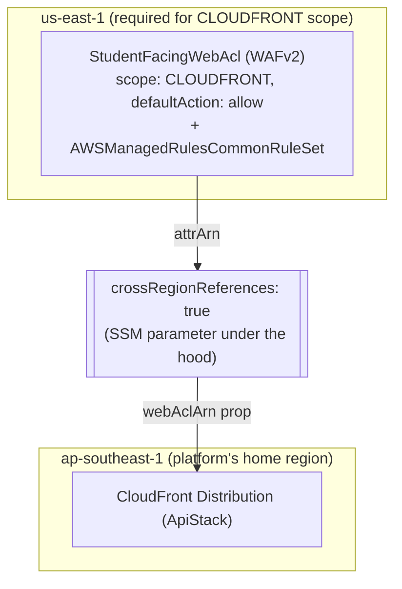

# WafStack — what's configured and why

`lib/stacks/waf-stack.ts` exists for one reason: AWS requires a CLOUDFRONT-scoped WAFv2 Web ACL
to be created in `us-east-1`, *regardless* of which region the CloudFront distribution's other
resources (and the rest of this platform) live in. Splitting this into its own tiny stack is the
only way to satisfy that constraint inside a single CDK app whose primary region is
`ap-southeast-1`.

Diagram: [`waf-stack.drawio`](./waf-stack.drawio) — Mermaid equivalent at the bottom of this file.

---

## Why this is a separate stack, pinned to `us-east-1`

```typescript
// bin/app.ts
const waf = new WafStack(app, `${stackPrefix}-Waf`, {
  env: { account: envConfig.account, region: 'us-east-1' },
  envConfig,
  crossRegionReferences: true,
});
```

Every other stack in this app deploys to `envConfig.region` (`ap-southeast-1`). A CDK `Stack`'s
region is fixed at synth time by its `env` prop — there's no way to make *part* of `ApiStack`
deploy to a different region than the rest of it. The only option is a second, separate `Stack`
construct with its own `env.region` override, which is exactly what `WafStack` is: a one-resource
stack whose sole job is existing in the right region.

- **`crossRegionReferences: true`** on both `WafStack` and `ApiStack` is what makes
  `waf.webAcl.attrArn` (a `us-east-1` value) usable as a prop into `ApiStack` (`ap-southeast-1`)
  at all. Without it, CDK would reject passing a token from one region's stack into another's —
  cross-stack references normally assume same-region `Fn::ImportValue`, which doesn't exist
  across regions. With it enabled on both ends, CDK instead writes the value to an SSM parameter
  in the producing region and reads it back via a custom resource in the consuming region — slower
  and more moving parts than a same-region reference, but the only mechanism AWS provides for this.

## The Web ACL itself: allow-by-default, one managed rule group

```typescript
this.webAcl = new wafv2.CfnWebACL(this, 'StudentFacingWebAcl', {
  scope: 'CLOUDFRONT',
  defaultAction: { allow: {} },
  rules: [{
    name: 'AWSManagedRulesCommonRuleSet',
    priority: 0,
    overrideAction: { none: {} },
    statement: { managedRuleGroupStatement: { vendorName: 'AWS', name: 'AWSManagedRulesCommonRuleSet' } },
    visibilityConfig: { cloudWatchMetricsEnabled: true, metricName: 'CommonRuleSet', sampledRequestsEnabled: true },
  }],
  visibilityConfig: { cloudWatchMetricsEnabled: true, metricName: `${props.envConfig.domainPrefix}-waf`, sampledRequestsEnabled: true },
});
```

- **`scope: 'CLOUDFRONT'`**, not `REGIONAL` — a Web ACL's scope determines which kind of resource
  it can attach to (CloudFront distributions vs. regional resources like an ALB or a *regional*
  API Gateway). This one attaches to `ApiStack`'s `cloudfront.Distribution`, so it has to be the
  `CLOUDFRONT` scope — which is also exactly why it has to live in `us-east-1` (see above).
- **`defaultAction: { allow: {} }`** — traffic is allowed unless a rule explicitly blocks it.
  This is the standard model for a managed-rule-group setup: you're layering specific,
  well-understood threat signatures on top of otherwise-open traffic, not trying to default-deny
  and allowlist (which would need a much larger rule set to avoid blocking legitimate students).
- **One managed rule group — `AWSManagedRulesCommonRuleSet`** — AWS's baseline protection against
  common web exploits (oversized bodies, generic SQL injection/XSS patterns, known bad inputs)
  and nothing more specific. This platform doesn't currently add the more targeted managed groups
  AWS offers (e.g. `AWSManagedRulesSQLiRuleSet` for deeper SQL-injection coverage, or
  `AWSManagedRulesAnonymousIpList` to flag VPN/Tor traffic — relevant for an exam-integrity
  platform specifically, where someone masking their origin IP during an exam is a legitimate
  signal). One rule group is a reasonable baseline for a demo/portfolio scope, not a
  comprehensive WAF posture — a real deployment protecting graded exams would likely want at
  least the SQLi and anonymous-IP rule groups added alongside this one.
- **`overrideAction: { none: {} }`** means the rule group's own per-rule actions (block/count) are
  respected as AWS defines them, rather than this Web ACL forcing every rule in the group into
  count-only mode — `none` is what actually makes this rule group *enforce* anything; `count`
  here would make it purely observational.
- **Two separate `visibilityConfig`s** (one on the Web ACL overall, one on the individual rule)
  — each gets its own CloudWatch metric name and sampled-request logging, so "how much traffic
  is this Web ACL seeing overall" and "how much is specifically the common rule set catching" are
  distinguishable in CloudWatch rather than collapsed into one number.

## `CfnOutput` and the one consumer

```typescript
new cdk.CfnOutput(this, 'WebAclArn', {
  value: this.webAcl.attrArn,
  exportName: `ExamPlatform-${props.envConfig.envName}-WebAclArn`,
});
```

Same documentation/ops-tooling pattern as every other stack's outputs — the real wiring is
`bin/app.ts` passing `waf.webAcl.attrArn` directly into `ApiStack`'s `webAclArn` prop, which
becomes `cloudfront.Distribution`'s `webAclId`. `ApiStack` is the only consumer; nothing else in
this platform needs a Web ACL.

## Tags

This stack does **not** call `cdk.Tags.of(this).add(...)` the way every other stack in this app
does — a small inconsistency worth noting if standardizing tagging across the app later, since
its one resource (the Web ACL) currently goes untagged while everything else is tagged
`Project`/`Environment`.

---

## Diagram (Mermaid)


