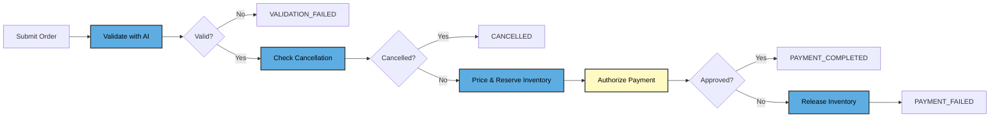
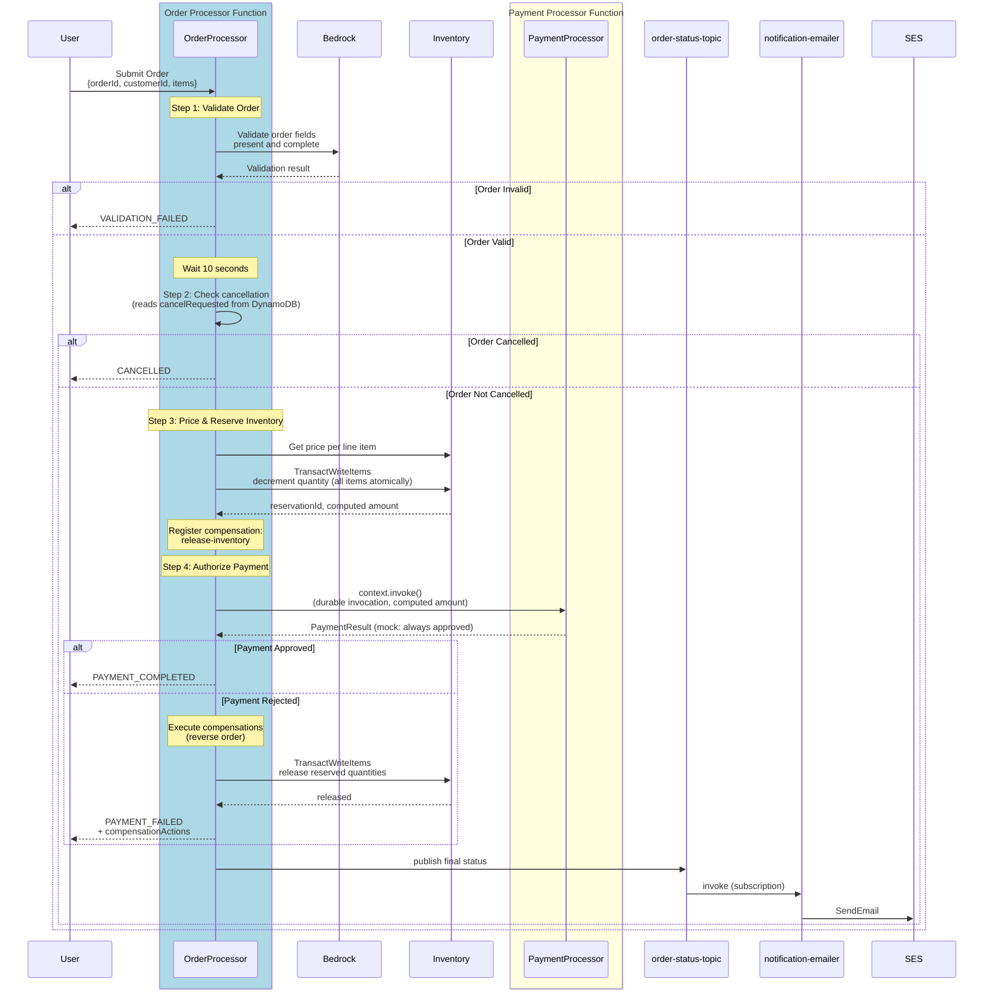

# Durable Functions Order Processing Demo

A CDK-based order processing workflow using AWS Lambda Durable Functions. Demonstrates saga compensation, AI validation with Amazon Bedrock, atomic multi-item inventory reservation with server-side pricing, SES email notifications, and durable function-to-function invocation.



> 🔵 **Blue** = Order Processor steps &nbsp;|&nbsp; 🟡 **Yellow** = Payment Processor steps

## Key Features

- **Durable Orchestration** — Order processor coordinates the entire workflow with automatic checkpointing at each step
- **AI Validation** — Amazon Bedrock (Nova Lite) validates order completeness
- **Server-Side Pricing** — Order total is computed from the `inventory` table's catalog price, never trusted from the client
- **Atomic Multi-Item Inventory** — Every line item is reserved/released in a single `TransactWriteItems` call, so a multi-item order either fully reserves or fully fails (no partial reservations, no overselling under concurrent orders)
- **Saga Compensation** — Inventory reservations are automatically released on payment failure (reverse-order compensation list)
- **Durable Invocation** — `context.invoke()` calls the payment processor and durably waits for its result
- **Email Notifications** — SNS topic fans out to a Lambda subscriber that emails order status via SES
- **Cancellation API** — `POST /orders/{orderId}/cancel` flags an order while it's still early in the workflow
- **API Docs** — `GET /docs` serves a Swagger UI for the REST API, backed by the OpenAPI spec at `GET /docs/openapi.json`
- **Wait Operations** — 10-second cancellation window using `context.wait()`
- **No Billing During Waits** — On-demand functions incur no compute charges during `context.wait()` and `context.invoke()` wait periods
- **Step Retry** — Each step retries up to 10 times with exponential backoff (the validation step includes simulated 50% flakiness to demonstrate this — see `validation.ts`)
- **Idempotency** — `--durable-execution-name` prevents duplicate order processing
- **Local & Cloud Testing** — `LocalDurableTestRunner` for fast mocked tests, `CloudDurableTestRunner` for deployed integration tests

## Quick Start

### Prerequisites

- [AWS CDK v2](https://docs.aws.amazon.com/cdk/latest/guide/) (`npm install -g aws-cdk`)
- [AWS CLI v2](https://docs.aws.amazon.com/cli/latest/userguide/install-cliv2.html) with configured credentials
- Node.js 18+
- [jq](https://jqlang.github.io/jq/) for JSON parsing in CLI examples
- Amazon Bedrock model access (Amazon Nova Lite is available by default in us-east-1)

> **Other regions/models?** Update `BEDROCK_MODEL_ID` in `lib/order-processing-stack.ts` and the IAM policy ARN to match your model.

### Deploy

```bash
export AWS_REGION=us-east-1   # region for CDK, Lambda, and Bedrock

npm install --save-dev
npm run build
npm test # run local tests
npx cdk bootstrap aws://<ACCOUNT_ID>/$AWS_REGION   # first time only
npx cdk deploy
```

After deploying:

1. **Verify the SES notification address.** SES is in sandbox mode, so AWS emails a verification link to the address configured as `NOTIFICATION_EMAIL` in `lib/order-processing-stack.ts` (default `issackpaul95@gmail.com`). Click it once — emails won't send until you do.
2. **Seed the inventory table** with at least one product (orders fail with "Unknown product" otherwise):

```bash
aws dynamodb put-item --table-name inventory --region $AWS_REGION \
  --item '{"productId": {"S": "PROD-001"}, "quantity": {"N": "100"}, "price": {"N": "49.99"}}'
```

### Try It

> 📘 **Explore the API interactively**: open the `ApiDocsUrl` CDK output in a browser for a Swagger UI you can submit/check/cancel orders from directly.

**1. Submit an order and capture the execution ARN:**

```bash
EXECUTION_ARN=$(aws lambda invoke \
  --function-name 'order-processor:$LATEST' \
  --invocation-type Event \
  --durable-execution-name "order-ORD-001" \
  --payload '{"orderId":"ORD-001","customerId":"CUST-123","items":[{"productId":"PROD-001","quantity":2}]}' \
  --cli-binary-format raw-in-base64-out \
  --output json \
  /dev/null | jq -r '.DurableExecutionArn')
echo "Execution ARN: $EXECUTION_ARN"
```

> 💡 **Watch progress** while waiting: Open the [Lambda console](https://console.aws.amazon.com/lambda/home#/functions/order-processor) → **Durable executions** tab for each function to see the workflow steps executing in real time.

Payment now auto-approves (see [Known Limitations](#known-limitations--planned-improvements)) — no manual callback step is needed. After the 10-second cancellation window, the order completes on its own.

**2. Check the result:**

```bash
aws lambda get-durable-execution \
  --durable-execution-arn "$EXECUTION_ARN"
```

Or check the persisted record (includes the server-computed `amount`):

```bash
aws dynamodb get-item --table-name orders --region $AWS_REGION \
  --key '{"orderId": {"S": "ORD-001"}}'
```

### Test Other Scenarios

**Invalid order** (missing fields → `VALIDATION_FAILED`, returns result immediately):
```bash
aws lambda invoke \
  --function-name 'order-processor:$LATEST' \
  --invocation-type RequestResponse \
  --durable-execution-name "order-ORD-BAD" \
  --payload '{"orderId":"ORD-BAD"}' \
  --cli-binary-format raw-in-base64-out \
  /dev/stdout | jq .
```

**Cancel before processing completes** (within the 10-second cancellation window → `CANCELLED`):
```bash
aws lambda invoke \
  --function-name order-api-handler \
  --payload '{"httpMethod":"POST","path":"/orders/ORD-001/cancel","pathParameters":{"orderId":"ORD-001"}}' \
  --cli-binary-format raw-in-base64-out \
  /dev/stdout | jq .
```

**Insufficient stock** (request more than is in the inventory table → `PAYMENT_FAILED`, no reservation made):
```bash
aws lambda invoke \
  --function-name 'order-processor:$LATEST' \
  --invocation-type RequestResponse \
  --durable-execution-name "order-ORD-OUT-OF-STOCK" \
  --payload '{"orderId":"ORD-OUT-OF-STOCK","customerId":"CUST-123","items":[{"productId":"PROD-001","quantity":999999}]}' \
  --cli-binary-format raw-in-base64-out \
  /dev/stdout | jq .
```

**Payment rejected**: the deployed `payment-processor` always approves (it's a mock — see [Known Limitations](#known-limitations--planned-improvements)). To exercise the rejection/saga-compensation path, run the local unit tests (`npm test`), which register a custom mock payment function that rejects.

## Project Structure

```
OrderProcessing/
├── bin/order-processing.ts                # CDK app entry point
├── lib/
│   ├── order-processing-stack.ts          # CDK stack (4 Lambda functions, IAM, logs)
│   └── lambda/
│       ├── order-processor.ts             # Orchestrator: validate → wait → check → price/reserve → pay
│       ├── payment-processor.ts           # Mock payment authorization (always approves)
│       ├── api-handler.ts                 # REST API: submit order, check status, request cancellation
│       ├── notification-emailer.ts        # SNS subscriber: forwards order status as email via SES
│       ├── types.ts                       # Shared interfaces
│       ├── config.ts                      # Bedrock model, timeouts, retry config
│       ├── validation.ts                  # Bedrock AI validation + cancellation check
│       ├── inventory.ts                   # Catalog pricing + atomic multi-item reserve/release
│       ├── order-store.ts                 # Order record persistence in DynamoDB
│       └── order-processor-helpers.ts     # Response builders
├── test/
│   ├── order-processor.test.ts            # Local unit tests (mocked Bedrock/inventory)
│   ├── payment-processor.test.ts          # Local mock-payment tests
│   ├── api-handler.test.ts                # Local API handler tests
│   ├── order-store.test.ts                # Local persistence tests
│   └── order-processor.cloud.test.ts      # Cloud integration test
├── jest.config.js                         # Local test config
├── jest.cloud.config.js                   # Cloud test config
└── package.json
```

## Testing

### Local Tests

Run locally without deploying — uses `LocalDurableTestRunner` with mocked Bedrock and inventory:

```bash
npm test
```

| Scenario | Expected Result |
|----------|----------------|
| Valid order + approved payment | `PAYMENT_COMPLETED`, inventory kept |
| Valid order + rejected payment (custom mock payment processor) | `PAYMENT_FAILED`, inventory released (saga) |
| Payment invocation failure | `PAYMENT_FAILED`, inventory released (saga) |
| Invalid order (missing fields) | `VALIDATION_FAILED`, early exit |
| Cancelled order | `CANCELLED`, no payment step |

### Cloud Tests

Run against deployed functions using `CloudDurableTestRunner`:

```bash
export ORDER_PROCESSOR_FUNCTION_NAME="order-processor:\$LATEST"
npm run test:cloud
```

The cloud test sends an incomplete order to verify Bedrock validation rejects it (`VALIDATION_FAILED`). It completes in under 2 minutes.

## Configuration

| Setting | Default | Location |
|---------|---------|----------|
| Bedrock Model | `amazon.nova-lite-v1:0` | `config.ts` / CDK stack env |
| Region | `us-east-1` | `config.ts` |
| Cancellation Window | 10 seconds | `config.ts` |
| Retry Strategy | 10 attempts, exponential backoff (1s base, 2x) | `config.ts` |
| Order Processor Timeout | 1 min invocation / 15 min durable execution | CDK stack |
| Payment Processor Timeout | 1 min invocation / 10 min durable execution | CDK stack |
| Notification Email (SES) | `issackpaul95@gmail.com` | CDK stack (`NOTIFICATION_EMAIL` constant) |
| Log Retention | 7 days | CDK stack |
| Runtime | Node.js 22.x | CDK stack |

## Cleanup

```bash
npx cdk destroy
```

> **Note:** This demo uses `RemovalPolicy.DESTROY` on all resources including CloudWatch log groups. Running `cdk destroy` permanently deletes all deployed resources and logs. For production use, consider changing the removal policy in `lib/order-processing-stack.ts`.

## Troubleshooting

| Issue | Solution |
|-------|----------|
| Bedrock access denied | Verify deployment in **us-east-1**. For other regions, check Bedrock → Model access in console |
| CDK deploy fails | Run `npx cdk bootstrap`, check `aws sts get-caller-identity`, verify Node.js 18+ |
| Order fails with "Unknown product" | Seed the `inventory` table with that `productId` (see Deploy step 2) |
| Order fails with "Insufficient inventory" | The requested `quantity` exceeds the product's stock; check/raise `quantity` on the inventory item |
| No notification email arrives | Confirm the SES verification link was clicked (sandbox mode requires sender **and** recipient verified) |

## Known Limitations & Planned Improvements

| Gap | Current Behavior | Planned Fix |
|-----|-------------------|-------------|
| Payment is fake | `payment-processor.ts` auto-approves every charge (mock) — no real gateway is called | Integrate a real payment gateway (Stripe/Braintree/etc.) in place of the mock |

The other gaps previously tracked here are resolved: pricing is computed server-side from the `inventory` table, the `OrderStatusTopic` has an SES email subscriber, `POST /orders/{orderId}/cancel` provides real cancellation, and `Order` supports multiple line items.

## Additional Resources

- [AWS Lambda Durable Functions Documentation](https://docs.aws.amazon.com/lambda/latest/dg/durable-functions.html)
- [Durable Functions SDK for JavaScript](https://www.npmjs.com/package/@aws/durable-execution-sdk-js)
- [Amazon Bedrock Documentation](https://docs.aws.amazon.com/bedrock/)
- [AWS CDK Documentation](https://docs.aws.amazon.com/cdk/)

## License

This library is licensed under the Apache 2.0 License.

---

## Appendix: Detailed Architecture

This sequence diagram shows the complete technical implementation including all durable function operations, Bedrock integration, atomic inventory transactions, and the notification path:



**Key Technical Details:**
- **Saga Compensation** — Side-effecting steps register undo functions in a list, executed in reverse on failure
- **context.invoke()** — Durable invocation that waits for the called function to complete
- **Atomic Inventory Transactions** — `TransactWriteItems` reserves/releases every line item together, so a multi-item order never ends up partially reserved
- **Bedrock Integration** — Amazon Nova Lite validates order completeness
- **Step Isolation** — Each operation (validate, check, price/reserve, invoke) is a separate durable step
- **Automatic Retry** — Steps configured with exponential backoff retry strategy
- **Email Notifications** — SNS → Lambda → SES forwards every terminal status as an email

### Order States

| Status | Description |
|--------|-------------|
| `PAYMENT_COMPLETED` | Order validated, not cancelled, payment approved |
| `PAYMENT_FAILED` | Payment rejected, insufficient inventory, or processing error; any reservation made is released via saga compensation |
| `CANCELLED` | Order cancelled during cancellation window |
| `VALIDATION_FAILED` | Bedrock detected missing required fields |
| `PROCESSING_FAILED` | System error after retry exhaustion |
