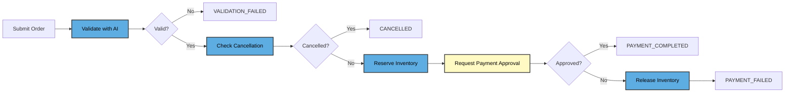
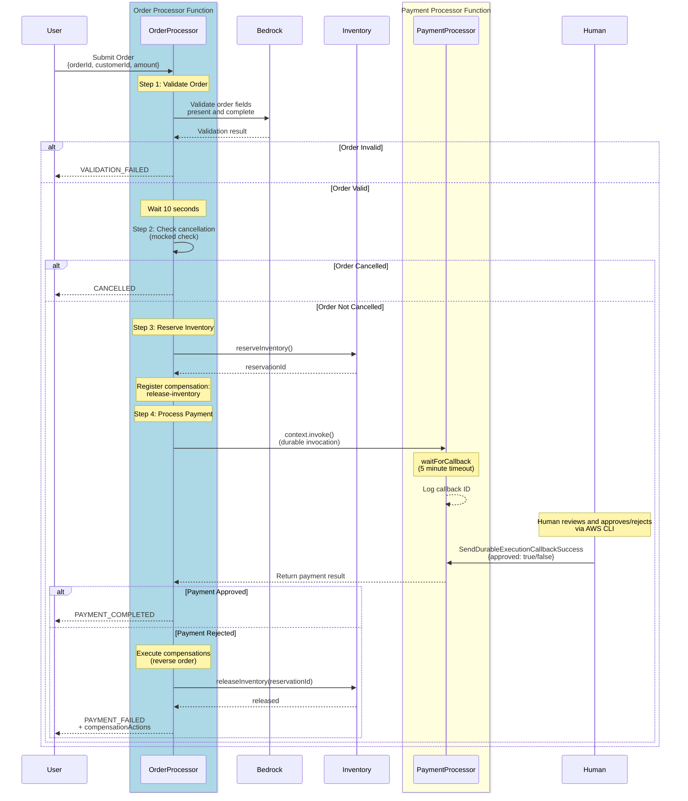

# Durable Functions Order Processing Demo

A CDK-based order processing workflow using AWS Lambda Durable Functions. Demonstrates saga compensation, AI validation with Amazon Bedrock, human-in-the-loop payment approval, and durable function-to-function invocation.



> 🔵 **Blue** = Order Processor steps &nbsp;|&nbsp; 🟡 **Yellow** = Payment Processor steps

## Key Features

- **Durable Orchestration** — Order processor coordinates the entire workflow with automatic checkpointing at each step
- **AI Validation** — Amazon Bedrock (Nova Lite) validates order completeness
- **Saga Compensation** — Inventory reservations are automatically released on payment failure (reverse-order compensation list)
- **Durable Invocation** — `context.invoke()` calls the payment processor and durably waits for its result
- **Human-in-the-Loop** — `waitForCallback()` pauses for human approval via callback
- **Wait Operations** — 10-second cancellation window using `context.wait()`
- **No Billing During Waits** — On-demand functions incur no compute charges during `context.wait()`, `waitForCallback()`, and `context.invoke()` wait periods
- **Step Retry** — Each step retries up to 10 times with exponential backoff (the validation step includes simulated 50% flakiness to demonstrate this — see `validation.ts`)
- **Idempotency** — `--durable-execution-name` prevents duplicate order processing
- **Local & Cloud Testing** — `LocalDurableTestRunner` for fast mocked tests, `CloudDurableTestRunner` for deployed integration tests

## Quick Start

### Prerequisites

- [AWS CDK v2](https://docs.aws.amazon.com/cdk/latest/guide/) (`npm install -g aws-cdk`)
- [AWS CLI v2](https://docs.aws.amazon.com/cli/latest/userguide/install-cliv2.html) with configured credentials
- Node.js 18+
- [jq](https://jqlang.github.io/jq/) for JSON parsing in CLI examples
- Amazon Bedrock model access (Amazon Nova Lite is available by default in us-east-1)

> **Other regions/models?** Update `BEDROCK_MODEL_ID` in `lib/order-processing-stack.ts` and the IAM policy ARN to match your model.

### Deploy

```bash
export AWS_REGION=us-east-1   # region for CDK, Lambda, and Bedrock

npm install --save-dev
npm run build
npm test # run local tests
npx cdk bootstrap aws://<ACCOUNT_ID>/$AWS_REGION   # first time only
npx cdk deploy
```

### Try It

**1. Submit an order and capture the execution ARN:**

```bash
EXECUTION_ARN=$(aws lambda invoke \
  --function-name 'order-processor:$LATEST' \
  --invocation-type Event \
  --durable-execution-name "order-ORD-001" \
  --payload '{"orderId":"ORD-001","customerId":"CUST-123","amount":99.99}' \
  --cli-binary-format raw-in-base64-out \
  --output json \
  /dev/null | jq -r '.DurableExecutionArn')
echo "Execution ARN: $EXECUTION_ARN"
```

> 💡 **Watch progress** while waiting: Open the [Lambda console](https://console.aws.amazon.com/lambda/home#/functions/order-processor) → **Durable executions** tab for each function to see the workflow steps executing in real time. You can also complete the below steps in the console.

**2. Get the payment processor's execution ARN, then extract the callback ID:**

```bash
# Get payment processor ARN from order processor history
PAYMENT_ARN=$(aws lambda get-durable-execution-history \
  --durable-execution-arn "$EXECUTION_ARN" \
  --include-execution-data | jq -r '
    .Events[] | select(.Name == "process-payment")
    | .ChainedInvokeStartedDetails.DurableExecutionArn')

# Get callback ID from payment processor history
CALLBACK_ID=$(aws lambda get-durable-execution-history \
  --durable-execution-arn "$PAYMENT_ARN" \
  --include-execution-data | jq -r '
    .Events[] | select(.EventType == "CallbackStarted")
    | .CallbackStartedDetails.CallbackId')
echo "Callback ID: $CALLBACK_ID"
```

**3. Approve the payment:**

```bash
aws lambda send-durable-execution-callback-success \
  --callback-id "$CALLBACK_ID" \
  --result '{"approved":true}' \
  --cli-binary-format raw-in-base64-out
```

**4. Check the result:**

```bash
aws lambda get-durable-execution \
  --durable-execution-arn "$EXECUTION_ARN"
```

### Test Other Scenarios

**Invalid order** (missing fields → `VALIDATION_FAILED`, returns result immediately):
```bash
aws lambda invoke \
  --function-name 'order-processor:$LATEST' \
  --invocation-type RequestResponse \
  --durable-execution-name "order-ORD-BAD" \
  --payload '{"orderId":"ORD-BAD"}' \
  --cli-binary-format raw-in-base64-out \
  /dev/stdout | jq .
```

**Reject payment** (triggers saga compensation → `PAYMENT_FAILED`, inventory released):
```bash
aws lambda send-durable-execution-callback-success \
  --callback-id "$CALLBACK_ID" \
  --result '{"approved":false,"reason":"Declined"}' \
  --cli-binary-format raw-in-base64-out
```

## Project Structure

```
OrderProcessing/
├── bin/order-processing.ts                # CDK app entry point
├── lib/
│   ├── order-processing-stack.ts          # CDK stack (2 Lambda functions, IAM, logs)
│   └── lambda/
│       ├── order-processor.ts             # Orchestrator: validate → wait → check → reserve → pay
│       ├── payment-processor.ts           # Callback handler: waitForCallback → approve/reject
│       ├── types.ts                       # Shared interfaces
│       ├── config.ts                      # Bedrock model, timeouts, retry config
│       ├── validation.ts                  # Bedrock AI validation
│       ├── inventory.ts                   # Reserve/release (simulated)
│       └── order-processor-helpers.ts     # Response builders
├── test/
│   ├── order-processor.test.ts            # Local unit tests (mocked Bedrock)
│   ├── payment-processor.test.ts          # Local callback tests
│   └── order-processor.cloud.test.ts      # Cloud integration test
├── jest.config.js                         # Local test config
├── jest.cloud.config.js                   # Cloud test config
└── package.json
```

## Testing

### Local Tests

Run locally without deploying — uses `LocalDurableTestRunner` with mocked Bedrock:

```bash
npm test
```

| Scenario | Expected Result |
|----------|----------------|
| Valid order + approved payment | `PAYMENT_COMPLETED`, inventory kept |
| Valid order + rejected payment | `PAYMENT_FAILED`, inventory released (saga) |
| Payment invocation failure | `PAYMENT_FAILED`, inventory released (saga) |
| Invalid order (missing fields) | `VALIDATION_FAILED`, early exit |
| Cancelled order | `CANCELLED`, no payment step |

### Cloud Tests

Run against deployed functions using `CloudDurableTestRunner`:

```bash
export ORDER_PROCESSOR_FUNCTION_NAME="order-processor:\$LATEST"
npm run test:cloud
```

The cloud test sends an incomplete order to verify Bedrock validation rejects it (`VALIDATION_FAILED`). No callback interaction needed — it completes in under 2 minutes.

## Configuration

| Setting | Default | Location |
|---------|---------|----------|
| Bedrock Model | `amazon.nova-lite-v1:0` | `config.ts` / CDK stack env |
| Region | `us-east-1` | `config.ts` |
| Cancellation Window | 10 seconds | `config.ts` |
| Payment Callback Timeout | 5 minutes | `config.ts` |
| Retry Strategy | 10 attempts, exponential backoff (1s base, 2x) | `config.ts` |
| Order Processor Timeout | 1 min invocation / 15 min durable execution | CDK stack |
| Payment Processor Timeout | 1 min invocation / 10 min durable execution | CDK stack |
| Log Retention | 7 days | CDK stack |
| Runtime | Node.js 22.x | CDK stack |

## Cleanup

```bash
npx cdk destroy
```

> **Note:** This demo uses `RemovalPolicy.DESTROY` on all resources including CloudWatch log groups. Running `cdk destroy` permanently deletes all deployed resources and logs. For production use, consider changing the removal policy in `lib/order-processing-stack.ts`.

## Troubleshooting

| Issue | Solution |
|-------|----------|
| Bedrock access denied | Verify deployment in **us-east-1**. For other regions, check Bedrock → Model access in console |
| CDK deploy fails | Run `npx cdk bootstrap`, check `aws sts get-caller-identity`, verify Node.js 18+ |
| Payment callback timeout | Payment processor returns `PAYMENT_FAILED`; order processor runs saga compensation |
| Can't find callback ID | Use `get-durable-execution-history --include-execution-data` (see Quick Start step 2) |

## Additional Resources

- [AWS Lambda Durable Functions Documentation](https://docs.aws.amazon.com/lambda/latest/dg/durable-functions.html)
- [Durable Functions SDK for JavaScript](https://www.npmjs.com/package/@aws/durable-execution-sdk-js)
- [Amazon Bedrock Documentation](https://docs.aws.amazon.com/bedrock/)
- [AWS CDK Documentation](https://docs.aws.amazon.com/cdk/)

## License

This library is licensed under the Apache 2.0 License.

---

## Appendix: Detailed Architecture

This sequence diagram shows the complete technical implementation including all durable function operations, Bedrock integration, and callback mechanisms:



**Key Technical Details:**
- **Saga Compensation** — Side-effecting steps register undo functions in a list, executed in reverse on failure
- **context.invoke()** — Durable invocation that waits for the called function to complete
- **waitForCallback()** — Pauses execution until external callback received (up to 5 minutes)
- **Bedrock Integration** — Amazon Nova Lite validates order completeness
- **Step Isolation** — Each operation (validate, check, reserve, invoke) is a separate durable step
- **Automatic Retry** — Steps configured with exponential backoff retry strategy
- **No Polling** — Callback mechanism eliminates need for status polling loops

### Order States

| Status | Description |
|--------|-------------|
| `PAYMENT_COMPLETED` | Order validated, not cancelled, payment approved |
| `PAYMENT_FAILED` | Payment rejected or failed; inventory released via saga compensation |
| `CANCELLED` | Order cancelled during cancellation window |
| `VALIDATION_FAILED` | Bedrock detected missing required fields |
| `PROCESSING_FAILED` | System error after retry exhaustion |
