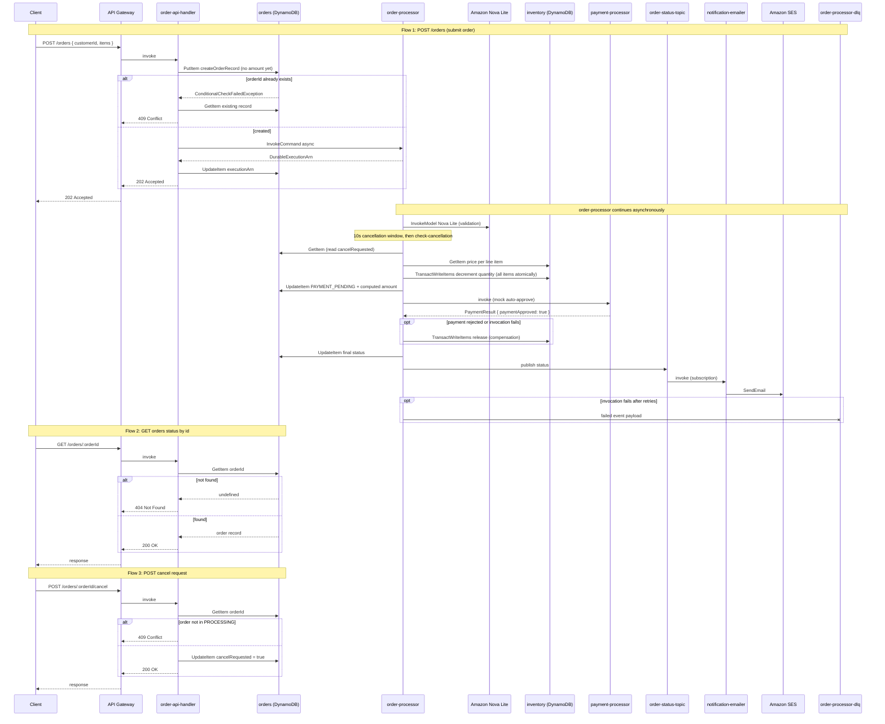

# Order Processing - Sequence Diagram

Covers all three API routes: submit order, check status, request cancellation.

```mermaid
sequenceDiagram
    participant Client
    participant APIGW as API Gateway
    participant ApiHandler as order-api-handler
    participant DDB as orders (DynamoDB)
    participant OrderProc as order-processor
    participant Bedrock as Amazon Nova Lite
    participant Inv as inventory (DynamoDB)
    participant PayProc as payment-processor
    participant SNS as order-status-topic
    participant Emailer as notification-emailer
    participant SES as Amazon SES
    participant DLQ as order-processor-dlq

    Note over Client,DLQ: Flow 1: POST /orders (submit order)
    Client->>APIGW: POST /orders { customerId, items }
    APIGW->>ApiHandler: invoke
    ApiHandler->>DDB: PutItem createOrderRecord (no amount yet)
    alt orderId already exists
        DDB-->>ApiHandler: ConditionalCheckFailedException
        ApiHandler->>DDB: GetItem existing record
        ApiHandler-->>APIGW: 409 Conflict
    else created
        ApiHandler->>OrderProc: InvokeCommand async
        OrderProc-->>ApiHandler: DurableExecutionArn
        ApiHandler->>DDB: UpdateItem executionArn
        ApiHandler-->>APIGW: 202 Accepted
    end
    APIGW-->>Client: 202 Accepted

    Note over OrderProc,DLQ: order-processor continues asynchronously
    OrderProc->>Bedrock: InvokeModel Nova Lite (validation)
    Note over OrderProc: 10s cancellation window, then check-cancellation
    OrderProc->>DDB: GetItem (read cancelRequested)
    OrderProc->>Inv: GetItem price per line item
    OrderProc->>Inv: TransactWriteItems decrement quantity (all items atomically)
    OrderProc->>DDB: UpdateItem PAYMENT_PENDING + computed amount
    OrderProc->>PayProc: invoke (mock auto-approve)
    PayProc-->>OrderProc: PaymentResult { paymentApproved: true }
    opt payment rejected or invocation fails
        OrderProc->>Inv: TransactWriteItems release (compensation)
    end
    OrderProc->>DDB: UpdateItem final status
    OrderProc->>SNS: publish status
    SNS->>Emailer: invoke (subscription)
    Emailer->>SES: SendEmail
    opt invocation fails after retries
        OrderProc-xDLQ: failed event payload
    end

    Note over Client,DDB: Flow 2: GET orders status by id
    Client->>APIGW: GET /orders/:orderId
    APIGW->>ApiHandler: invoke
    ApiHandler->>DDB: GetItem orderId
    alt not found
        DDB-->>ApiHandler: undefined
        ApiHandler-->>APIGW: 404 Not Found
    else found
        DDB-->>ApiHandler: order record
        ApiHandler-->>APIGW: 200 OK
    end
    APIGW-->>Client: response

    Note over Client,DDB: Flow 3: POST cancel request
    Client->>APIGW: POST /orders/:orderId/cancel
    APIGW->>ApiHandler: invoke
    ApiHandler->>DDB: GetItem orderId
    alt order not in PROCESSING
        ApiHandler-->>APIGW: 409 Conflict
    else
        ApiHandler->>DDB: UpdateItem cancelRequested = true
        ApiHandler-->>APIGW: 200 OK
    end
    APIGW-->>Client: response
```
