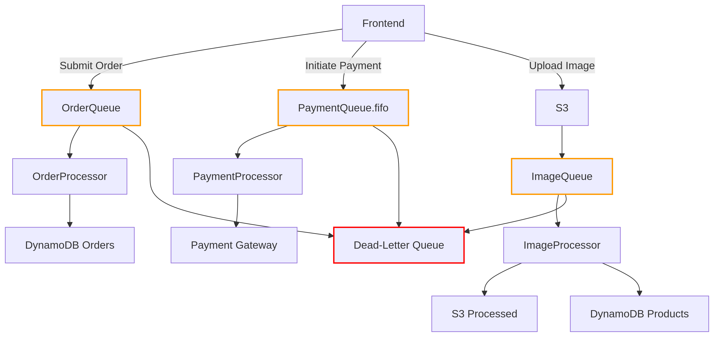
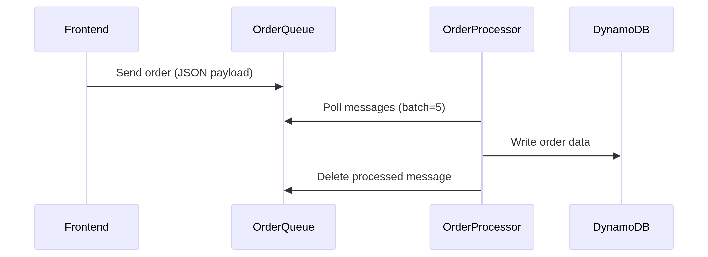
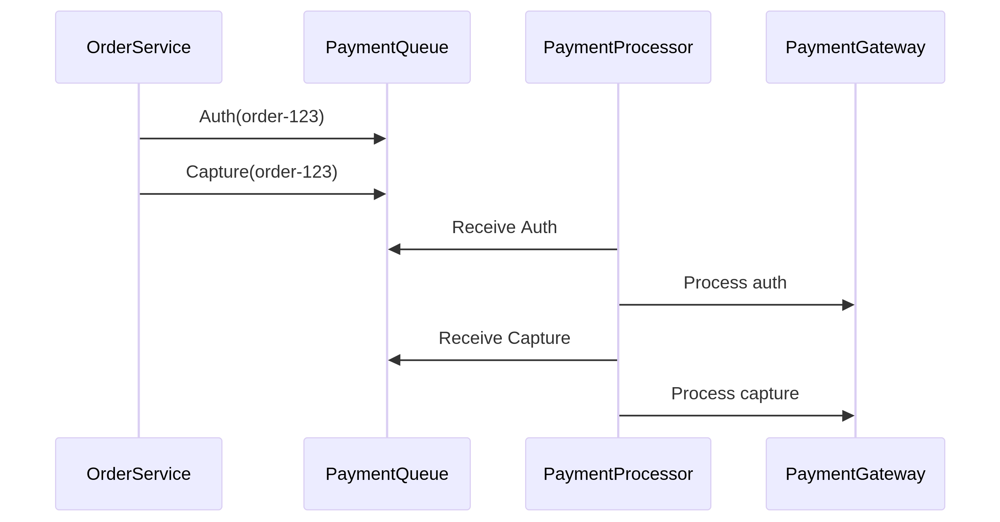
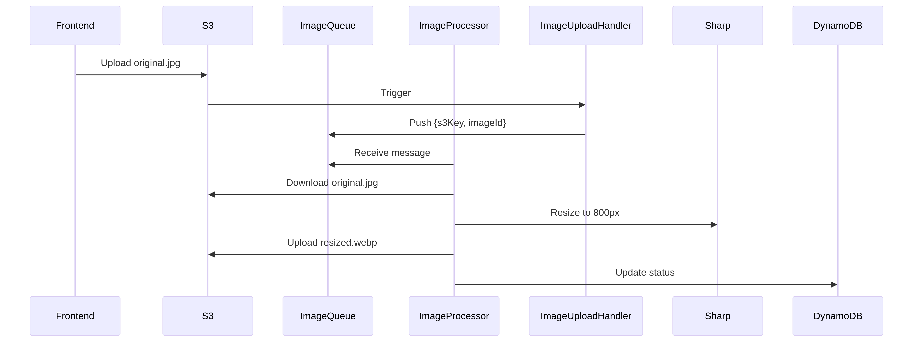

# Unified Architecture Diagram
 

## 1. Order Processing (DB Write Buffer Pattern)
 
**Use Case: Handle flash sale traffic spikes without overwhelming the database**

## 2. Payment Processing (FIFO Ordered Processing)
 
**Use Case: Ensure payment steps execute in exact sequence (Auth → Capture → Settlement)**

## 3. Image Processing (Decoupled Heavy Workloads)
 
**Use Case: Async image resizing without blocking user requests**

## S3 Bucket creation
## Give permission to access queue and s3
## First Dummy Queue created then added url to lambda, then real queue added in lambda, so need to remove dummy queue from lambda 